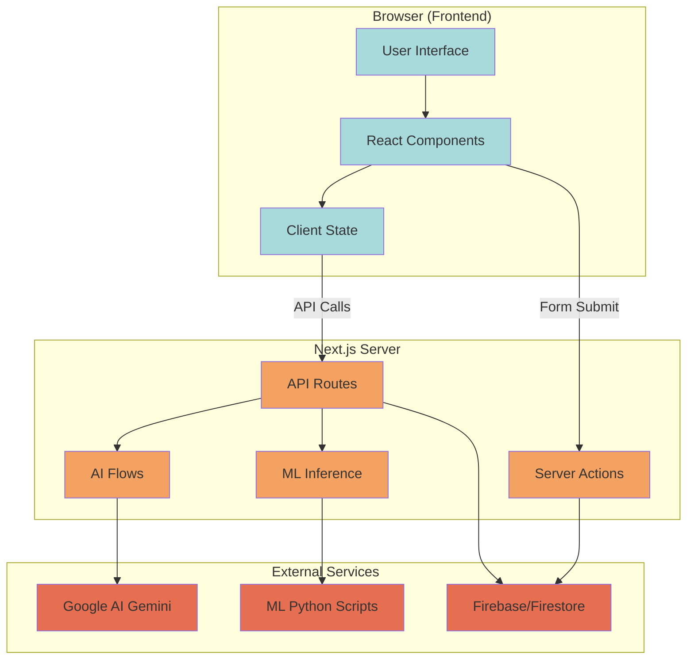
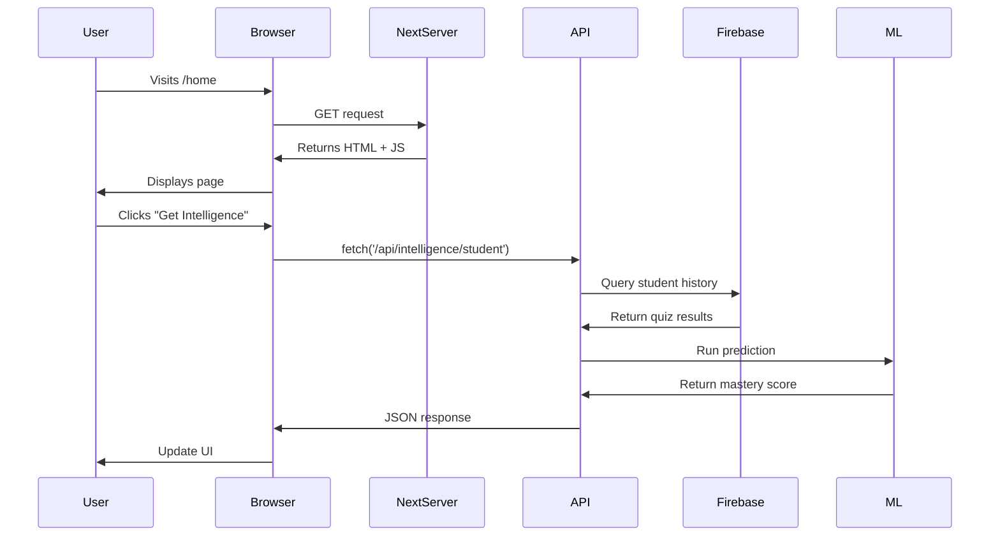

# SANKALP Architecture Guide

## Frontend vs Backend: How It Works in Next.js 15

### 🎯 The Simple Answer

**You don't need separate folders!** Next.js automatically handles frontend/backend separation through:

1. **File Location** - Where you put the code
2. **File Type** - What kind of file it is
3. **Directives** - Special markers like `'use client'`

---

## Visual Architecture



---

## Directory Structure Breakdown

```
SANKALP/
├── src/
│   ├── app/                    # NEXT.JS APP ROUTER
│   │   ├── (auth)/             # 🟢 FRONTEND: Login/Signup pages
│   │   ├── (main)/             # 🟢 FRONTEND: Dashboard, Quiz, Syllabus
│   │   └── api/                # 🔴 BACKEND: API endpoints
│   │       └── intelligence/   # Example: ML predictions endpoint
│   │
│   ├── components/             # 🟢 FRONTEND: React UI components
│   │   ├── ui/                 # Basic UI primitives (Button, Card)
│   │   ├── app/                # App-specific components
│   │   └── planner/            # Revision planner components
│   │
│   ├── ai/                     # 🔴 BACKEND: AI logic
│   │   ├── flows/              # Genkit flows (Syllabus, Quiz, Chat)
│   │   ├── adk/                # ADK decision engine
│   │   └── genkit.ts           # AI configuration
│   │
│   ├── ml/                     # 🔴 BACKEND: ML system
│   │   ├── features/           # Feature engineering (TS)
│   │   ├── training/           # Model training (Python)
│   │   ├── inference/          # Prediction scripts (Python)
│   │   └── models/             # Trained .pkl models
│   │
│   ├── lib/                    # 🟡 SHARED: Utilities
│   │   ├── firebase.ts         # 🟢 Client-side Firebase (browser)
│   │   ├── firebase-admin.ts   # 🔴 Server-side Firebase (API routes)
│   │   └── utils.ts            # Shared helpers
│   │
│   ├── types/                  # 🟡 SHARED: TypeScript types
│   ├── hooks/                  # 🟢 FRONTEND: React hooks
│   └── contexts/               # 🟢 FRONTEND: React context
│
├── public/                     # 🟢 FRONTEND: Static assets (images, fonts)
└── .env.local                  # 🔴 BACKEND: Environment secrets
```

**Legend:**
- 🟢 **Frontend** - Runs in user's browser
- 🔴 **Backend** - Runs on server only
- 🟡 **Shared** - Can be used by both

---

## Code Execution Flow

### Example: Dashboard Intelligence Display

1. **User visits `/home`** (Frontend)
   - File: `src/app/(main)/home/page.tsx`
   - Renders dashboard UI in browser

2. **Page fetches student data** (Frontend → Backend transition)
   ```typescript
   // Frontend component
   const response = await fetch('/api/intelligence/student?studentId=123');
   ```

3. **API route receives request** (Backend)
   - File: `src/app/api/intelligence/student/route.ts`
   - Runs on server, has access to secrets

4. **API queries database** (Backend)
   ```typescript
   // Server-side code
   const studentHistory = await getStudentFromFirestore('123');
   ```

5. **API calls ML system** (Backend)
   ```typescript
   // Still server-side
   const prediction = await predictMastery(features);
   ```

6. **API returns JSON** (Backend → Frontend)
   ```typescript
   return NextResponse.json({ masteryScore: 0.85, ... });
   ```

7. **Frontend displays result** (Frontend)
   ```tsx
   <MasteryCard score={data.masteryScore} />
   ```

---

## Key Rules

### ✅ DO: Frontend (`src/app/(main)`, `src/components`)

- ✅ Display UI components
- ✅ Handle user interactions (clicks, form inputs)
- ✅ Manage local state (useState, useContext)
- ✅ Call API routes via `fetch()` or `axios`
- ✅ Use `'use client'` directive for interactive components

**Example:**
```tsx
'use client';

export default function QuizPage() {
  const [score, setScore] = useState(0);
  
  async function submitQuiz(answers: Answer[]) {
    const result = await fetch('/api/quiz/submit', {
      method: 'POST',
      body: JSON.stringify(answers)
    });
    setScore(result.score);
  }
  
  return <QuizForm onSubmit={submitQuiz} />;
}
```

---

### ✅ DO: Backend (`src/app/api`, `src/ai`, `src/ml`)

- ✅ Access databases (Firestore, PostgreSQL)
- ✅ Use API keys and secrets
- ✅ Run ML models and AI flows
- ✅ Authenticate users
- ✅ Process payment transactions
- ✅ Send emails/notifications

**Example:**
```typescript
// src/app/api/quiz/submit/route.ts
import { firebaseAdmin } from '@/lib/firebase-admin';

export async function POST(request: Request) {
  const answers = await request.json();
  
  // Backend can safely access database
  await firebaseAdmin.firestore().collection('quizResults').add({
    studentId: answers.studentId,
    score: calculateScore(answers),
    timestamp: new Date()
  });
  
  return NextResponse.json({ success: true });
}
```

---

### ❌ DON'T: Common Mistakes

| ❌ **Wrong** | ✅ **Right** |
|-------------|-------------|
| Access database from frontend component | Create API route, call it from frontend |
| Put API keys in frontend code | Store in `.env.local`, use in API routes |
| Run Python ML scripts in browser | Call Python from API route using `child_process` |
| Make Firestore queries in `page.tsx` | Use Server Component or API route |
| Store user passwords in localStorage | Use Firebase Auth or NextAuth.js |

---

## Where to Add New Features

### Adding a New Quiz Type

1. **Frontend Component**: `src/components/quiz/NewQuizType.tsx`
   ```tsx
   'use client';
   export function NewQuizType() {
     // UI logic only
   }
   ```

2. **API Route**: `src/app/api/quiz/new-type/route.ts`
   ```typescript
   export async function POST(request: Request) {
     // Database logic, AI generation
   }
   ```

3. **AI Flow** (if using LLM): `src/ai/flows/new-quiz-generator.ts`
   ```typescript
   export const newQuizFlow = defineFlow({ ... });
   ```

---

### Adding a Teacher Dashboard

1. **Frontend Page**: `src/app/(main)/teacher/dashboard/page.tsx`
2. **API Route**: `src/app/api/teacher/students/route.ts`
3. **Database Query**: `src/lib/db-helpers.ts` → `getTeacherStudents()`

---

## Security Boundaries

### What Frontend Can Access
- ✅ Public environment variables (`NEXT_PUBLIC_*`)
- ✅ User's own data (after authentication)
- ✅ Public API endpoints
- ❌ Other users' data
- ❌ Database credentials
- ❌ API keys

### What Backend Can Access
- ✅ All environment variables
- ✅ Database with full permissions
- ✅ External APIs (Gemini, etc.)
- ✅ File system
- ✅ Python scripts

---

## Data Flow Diagram



---

## Environment Variables Guide

### `.env.local` (Backend secrets)
```env
# Firebase Admin (BACKEND ONLY)
FIREBASE_PROJECT_ID=sankalp-prerollout
FIREBASE_PRIVATE_KEY=...
FIREBASE_CLIENT_EMAIL=...

# AI APIs (BACKEND ONLY)
GEMINI_API_KEY=...

# Database (BACKEND ONLY)
DATABASE_URL=...
```

### Client-side variables (if needed)
```env
# These are exposed to browser!
NEXT_PUBLIC_FIREBASE_API_KEY=...
NEXT_PUBLIC_APP_NAME=Sankalp
```

---

## Quick Reference

### "Is this frontend or backend code?"

Ask these questions:

1. **Does it display UI?** → Frontend
2. **Does it access a database?** → Backend
3. **Does it use API keys?** → Backend
4. **Does it run in the browser?** → Frontend
5. **Is it in `/api/` folder?** → Backend
6. **Does it have `'use client'`?** → Frontend (if in app directory)

---

## Next Steps for Pre-Rollout

See [PRE_ROLLOUT_CHECKLIST.md](./PRE_ROLLOUT_CHECKLIST.md) for complete deployment guide.

**Critical items:**
1. ✅ Structure is already correct (you're good!)
2. ⚠️ Replace mock data with real Firebase queries
3. ⚠️ Set up authentication
4. ⚠️ Configure production environment variables
5. ⚠️ Deploy to Vercel/Firebase Hosting
