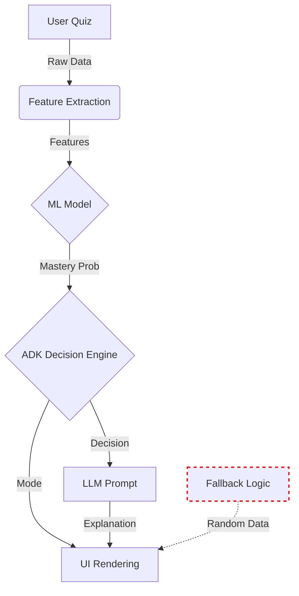

# Causal Integrity Report

## 1. Visual Causal Flow (DAG)


## 2. Semantic Coherence Violation Matrix
| Scenario | Violations Found |
|---|---|
| Baseline: Good Student | 🔴 1 |
| Fault: ML Under-prediction | 🔴 4 |
| Edge: Future Quiz Date | 🔴 2 |

## 3. Silent Failure Cascade Scenarios
- **Scenario 1: API Failure -> Fallback Divergence**. If the ML API is unreachable, the frontend silently falls back to `generateStudentIntelligence`, which uses random numbers for revision dates. This causes the UI to recommend revision for topics recently mastered, or ignore stale topics.
- **Scenario 2: Future Date Corruption**. If a client sends a future timestamp (e.g., misconfigured clock), Feature Extraction produces negative `days_since_revision`. This propagates to ML and ADK without error, potentially causing erratic retention predictions.
- **Scenario 3: High Score / Low Mastery**. If the ML model drifts or is poisoned (e.g. predicts 0.1 mastery for 0.9 quiz score), the ADK triggers 'ADAPTIVE_TEACHING' for a mastered topic. The UI reflects this with 'High Priority', confusing the user.

## 4. Blast Radius Analysis
| Failure Point | Impact Scope | User Perception | Severity |
|---|---|---|---|
| **Feature Extraction (Negative Time)** | ML, ADK, UI | Confusing retention stats | Medium |
| **ML Prediction (Model Drift)** | ADK, UI, LLM | Wrong study recommendations | High |
| **Fallback Logic (Random)** | UI | 'It works but it's wrong' | Critical |

## 5. Recommended Circuit Breakers
To prevent these silent failures, the following semantic guards should be implemented:

### A. Feature Extraction Guard
```typescript
if (days_since_last_revision < 0) {
    console.warn('Future date detected, clamping to 0');
    days_since_last_revision = 0;
}
```

### B. ML Sanity Check
```typescript
// In ml-bridge.ts
if (features.avg_quiz_score > 0.8 && prediction.mastery_probability < 0.2) {
    // Flag for review, potentially fallback to rule-based heuristic
    return { ...prediction, predicted_class: 'error', error: 'Semantic mismatch' };
}
```

### C. Fallback Synchronization
Replace `generateStudentIntelligence` random logic with a deterministic heuristic that mirrors the ML model (e.g. `score * 0.9`).

## 6. Detailed Trace Logs
### Baseline: Good Student
**Violations:**
- Silent Failure: Fallback logic uses random revision dates (8 vs actual 0)

**Trace Output:**
```json
{
  "featureExtraction": {
    "name": "Feature Extraction",
    "input": {
      "studentId": "student-1",
      "lastLoginDate": "2026-02-18T06:31:29.706Z",
      "registrationDate": "2026-02-18T06:31:29.706Z",
      "quizResults": [
        {
          "topic": "Calculus",
          "score": 0.9,
          "timestamp": "2026-02-18T06:31:29.706Z",
          "timeSpent": 60,
          "questionsAttempted": 10
        }
      ]
    },
    "output": {
      "avg_quiz_score": 0.9,
      "attempts_per_topic": 1,
      "days_since_last_revision": 0,
      "quiz_score_variance": 0,
      "time_spent_per_question": 6
    },
    "warnings": [],
    "semanticValid": true
  },
  "mlPrediction": {
    "name": "ML Prediction",
    "input": {
      "avg_quiz_score": 0.9,
      "attempts_per_topic": 1,
      "days_since_last_revision": 0,
      "quiz_score_variance": 0,
      "time_spent_per_question": 6
    },
    "output": {
      "mastery_probability": 0.8600000000000001,
      "confidence": 0.8,
      "predicted_class": "mastered"
    },
    "warnings": [],
    "semanticValid": true
  },
  "adkDecision": {
    "name": "ADK Decision",
    "input": {
      "topic": "Calculus",
      "mlSignals": {
        "mastery_probability": 0.8600000000000001,
        "confidence": 0.8,
        "days_since_last_revision": 0,
        "attempts_count": 1,
        "attention_risk": "LOW"
      }
    },
    "output": {
      "action": "PROGRESS_ALLOWED",
      "priority": "LOW",
      "contentStrategy": "CHALLENGE",
      "reasoning": "Strong mastery - ready for advanced content",
      "adkFlags": [
        "MASTERY_ACHIEVED"
      ],
      "llmContext": {
        "strategy": "CHALLENGE",
        "targetDuration": "15-MIN",
        "tone": "CHALLENGING",
        "includeExamples": false,
        "includeVisuals": false,
        "difficulty": "ADVANCED"
      }
    },
    "warnings": [],
    "semanticValid": true
  },
  "uiRendering": {
    "name": "UI Rendering",
    "input": {
      "mastery": {
        "Calculus": {
          "score": 0.8600000000000001,
          "priority": "LOW",
          "needsRevision": false
        }
      },
      "adkDecision": "PROGRESS_MODE",
      "reasoning": [
        "Strong mastery - ready for advanced content"
      ]
    },
    "output": "Tooltip: Strong mastery - ready for advanced content | Mode: PROGRESS_MODE",
    "warnings": [],
    "semanticValid": true
  },
  "fallbackCheck": {
    "name": "Fallback Logic Check",
    "input": null,
    "output": {
      "studentId": "student-1",
      "mastery": {
        "Calculus": {
          "score": 0.9,
          "confidence": 0.8,
          "daysSinceRevision": 8,
          "attempts": 5,
          "trend": "IMPROVING",
          "priority": "MEDIUM",
          "needsRevision": true
        }
      },
      "revisionUrgency": "NONE",
      "attentionRisk": "LOW",
      "adkDecision": "PROGRESS_MODE",
      "confidence": "HIGH",
      "generatedAt": "2026-02-18T06:31:29.707Z",
      "reasoning": [
        "Average mastery: 90%",
        "0 high-priority topics",
        "No specific weaknesses identified"
      ],
      "flags": []
    },
    "warnings": [],
    "semanticValid": false
  }
}
```

### Fault: ML Under-prediction
**Violations:**
- ML Integrity: High quiz score (0.9) led to low mastery prediction (0.1)
- UI Integrity: High priority decision mapped to PROGRESS_MODE
- Silent Failure: Fallback logic divergence. ML predicted 0.10 but fallback generated 0.90
- Silent Failure: Fallback logic uses random revision dates (13 vs actual 0)

**Trace Output:**
```json
{
  "featureExtraction": {
    "name": "Feature Extraction",
    "input": {
      "studentId": "student-1",
      "lastLoginDate": "2026-02-18T06:31:29.706Z",
      "registrationDate": "2026-02-18T06:31:29.706Z",
      "quizResults": [
        {
          "topic": "Calculus",
          "score": 0.9,
          "timestamp": "2026-02-18T06:31:29.706Z",
          "timeSpent": 60,
          "questionsAttempted": 10
        }
      ]
    },
    "output": {
      "avg_quiz_score": 0.9,
      "attempts_per_topic": 1,
      "days_since_last_revision": 0,
      "quiz_score_variance": 0,
      "time_spent_per_question": 6
    },
    "warnings": [],
    "semanticValid": true
  },
  "mlPrediction": {
    "name": "ML Prediction",
    "input": {
      "avg_quiz_score": 0.9,
      "attempts_per_topic": 1,
      "days_since_last_revision": 0,
      "quiz_score_variance": 0,
      "time_spent_per_question": 6
    },
    "output": {
      "mastery_probability": 0.1,
      "confidence": 0.8,
      "predicted_class": "mastered"
    },
    "warnings": [],
    "semanticValid": false
  },
  "adkDecision": {
    "name": "ADK Decision",
    "input": {
      "topic": "Calculus",
      "mlSignals": {
        "mastery_probability": 0.1,
        "confidence": 0.8,
        "days_since_last_revision": 0,
        "attempts_count": 1,
        "attention_risk": "HIGH"
      }
    },
    "output": {
      "action": "ADAPTIVE_TEACHING",
      "priority": "HIGH",
      "contentStrategy": "INTERACTIVE",
      "reasoning": "Low mastery with attention challenges - needs engaging format",
      "adkFlags": [
        "ADAPTIVE_TEACHING",
        "ATTENTION_RISK"
      ],
      "llmContext": {
        "strategy": "INTERACTIVE",
        "targetDuration": "2-MIN",
        "tone": "MOTIVATING",
        "includeExamples": true,
        "includeVisuals": true,
        "difficulty": "BASIC"
      }
    },
    "warnings": [],
    "semanticValid": true
  },
  "uiRendering": {
    "name": "UI Rendering",
    "input": {
      "mastery": {
        "Calculus": {
          "score": 0.1,
          "priority": "HIGH",
          "needsRevision": true
        }
      },
      "adkDecision": "PROGRESS_MODE",
      "reasoning": [
        "Low mastery with attention challenges - needs engaging format"
      ]
    },
    "output": "Tooltip: Low mastery with attention challenges - needs engaging format | Mode: PROGRESS_MODE",
    "warnings": [],
    "semanticValid": false
  },
  "fallbackCheck": {
    "name": "Fallback Logic Check",
    "input": null,
    "output": {
      "studentId": "student-1",
      "mastery": {
        "Calculus": {
          "score": 0.9,
          "confidence": 0.8,
          "daysSinceRevision": 13,
          "attempts": 9,
          "trend": "IMPROVING",
          "priority": "HIGH",
          "needsRevision": true
        }
      },
      "revisionUrgency": "SCHEDULED",
      "attentionRisk": "LOW",
      "adkDecision": "PROGRESS_MODE",
      "confidence": "HIGH",
      "generatedAt": "2026-02-18T06:31:29.707Z",
      "reasoning": [
        "Average mastery: 90%",
        "1 high-priority topics",
        "No specific weaknesses identified"
      ],
      "flags": []
    },
    "warnings": [],
    "semanticValid": false
  }
}
```

### Edge: Future Quiz Date
**Violations:**
- Feature Extraction: Negative days since last revision
- Silent Failure: Fallback logic uses random revision dates (12 vs actual -5)

**Trace Output:**
```json
{
  "featureExtraction": {
    "name": "Feature Extraction",
    "input": {
      "studentId": "student-1",
      "lastLoginDate": "2026-02-18T06:31:29.706Z",
      "registrationDate": "2026-02-18T06:31:29.706Z",
      "quizResults": [
        {
          "topic": "Calculus",
          "score": 0.9,
          "timestamp": "2026-02-23T06:31:29.707Z",
          "timeSpent": 60,
          "questionsAttempted": 10
        }
      ]
    },
    "output": {
      "avg_quiz_score": 0.9,
      "attempts_per_topic": 1,
      "days_since_last_revision": -5,
      "quiz_score_variance": 0,
      "time_spent_per_question": 6
    },
    "warnings": [
      "Negative days_since_last_revision: -5"
    ],
    "semanticValid": false
  },
  "mlPrediction": {
    "name": "ML Prediction",
    "input": {
      "avg_quiz_score": 0.9,
      "attempts_per_topic": 1,
      "days_since_last_revision": -5,
      "quiz_score_variance": 0,
      "time_spent_per_question": 6
    },
    "output": {
      "mastery_probability": 0.8600000000000001,
      "confidence": 0.8,
      "predicted_class": "mastered"
    },
    "warnings": [],
    "semanticValid": true
  },
  "adkDecision": {
    "name": "ADK Decision",
    "input": {
      "topic": "Calculus",
      "mlSignals": {
        "mastery_probability": 0.8600000000000001,
        "confidence": 0.8,
        "days_since_last_revision": -5,
        "attempts_count": 1,
        "attention_risk": "LOW"
      }
    },
    "output": {
      "action": "PROGRESS_ALLOWED",
      "priority": "LOW",
      "contentStrategy": "CHALLENGE",
      "reasoning": "Strong mastery - ready for advanced content",
      "adkFlags": [
        "MASTERY_ACHIEVED"
      ],
      "llmContext": {
        "strategy": "CHALLENGE",
        "targetDuration": "15-MIN",
        "tone": "CHALLENGING",
        "includeExamples": false,
        "includeVisuals": false,
        "difficulty": "ADVANCED"
      }
    },
    "warnings": [],
    "semanticValid": true
  },
  "uiRendering": {
    "name": "UI Rendering",
    "input": {
      "mastery": {
        "Calculus": {
          "score": 0.8600000000000001,
          "priority": "LOW",
          "needsRevision": false
        }
      },
      "adkDecision": "PROGRESS_MODE",
      "reasoning": [
        "Strong mastery - ready for advanced content"
      ]
    },
    "output": "Tooltip: Strong mastery - ready for advanced content | Mode: PROGRESS_MODE",
    "warnings": [],
    "semanticValid": true
  },
  "fallbackCheck": {
    "name": "Fallback Logic Check",
    "input": null,
    "output": {
      "studentId": "student-1",
      "mastery": {
        "Calculus": {
          "score": 0.9,
          "confidence": 0.8,
          "daysSinceRevision": 12,
          "attempts": 9,
          "trend": "IMPROVING",
          "priority": "HIGH",
          "needsRevision": true
        }
      },
      "revisionUrgency": "SCHEDULED",
      "attentionRisk": "LOW",
      "adkDecision": "PROGRESS_MODE",
      "confidence": "HIGH",
      "generatedAt": "2026-02-18T06:31:29.707Z",
      "reasoning": [
        "Average mastery: 90%",
        "1 high-priority topics",
        "No specific weaknesses identified"
      ],
      "flags": []
    },
    "warnings": [],
    "semanticValid": false
  }
}
```
