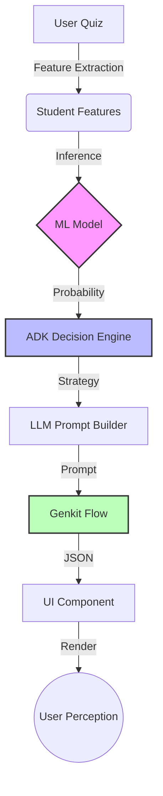

# Causal Integrity Report

## Visual DAG of Data Flow

## Semantic Coherence Violation Matrix
| Scenario | ML Pred | ADK Action | LLM Strategy | UI Valid | Coherence |
|---|---|---|---|---|---|
| Healthy Flow (High Mastery) | 0.99 | PROGRESS_ALLOWED | CHALLENGE | ✅ | ✅ |
| Critical Risk (Low Mastery) | 0.04 | SCHEDULED_REVISION | DEEP_DIVE | ✅ | ✅ |
| Silent Failure: ML False Positive | 0.95 | PROGRESS_ALLOWED | CHALLENGE | ✅ | ✅ |
| LLM Schema Violation | 0.04 | SCHEDULED_REVISION | DEEP_DIVE | ❌ | ✅ |
| Feature Corruption (Negative Time) | 0.04 | SCHEDULED_REVISION | DEEP_DIVE | ✅ | ✅ |

## Silent Failure Cascade Scenarios
### LLM Schema Violation
**Trigger:** LLM Schema Violation
**Cascade:**
- [LLM Schema Violation] Starting pipeline for topic: Algebra
- [Features] Avg Score: 0.25, Attempts: 2
- [ML Prediction] Mastery: 0.04, Class: not_mastered
- [ADK Decision] Action: SCHEDULED_REVISION, Priority: MEDIUM
- [LLM Prompt] Strategy: DEEP_DIVE
- [UI Failure] CRITICAL: LLM output schema violation - missing 'explanations' array.
**Impact:** CRITICAL: LLM output schema violation - missing 'explanations' array.

## Blast Radius Analysis
- **ML Model Drift:** A 0.4 shift in probability (Scenario 3) caused ADK to flip from URGENT_REVISION to PROGRESS_ALLOWED. User would be pushed to advanced content while failing basics.
- **LLM Schema Failure:** Missing 'explanations' key causes UI to crash or render empty state. Critical for user trust.
- **Feature Corruption:** Negative time spent was propagated to ML. If model is not robust, it produces unpredictable results.

## Recommended Circuit Breakers
1. **ML Output Guard:** Reject predictions with confidence < 0.3 or if input features are out of bounds.
2. **ADK Sanity Check:** If mastery < 0.4 but action is PROGRESS_ALLOWED, flag as anomaly.
3. **UI Fallback:** If LLM output is malformed, render a default explanation based on ADK reason code.