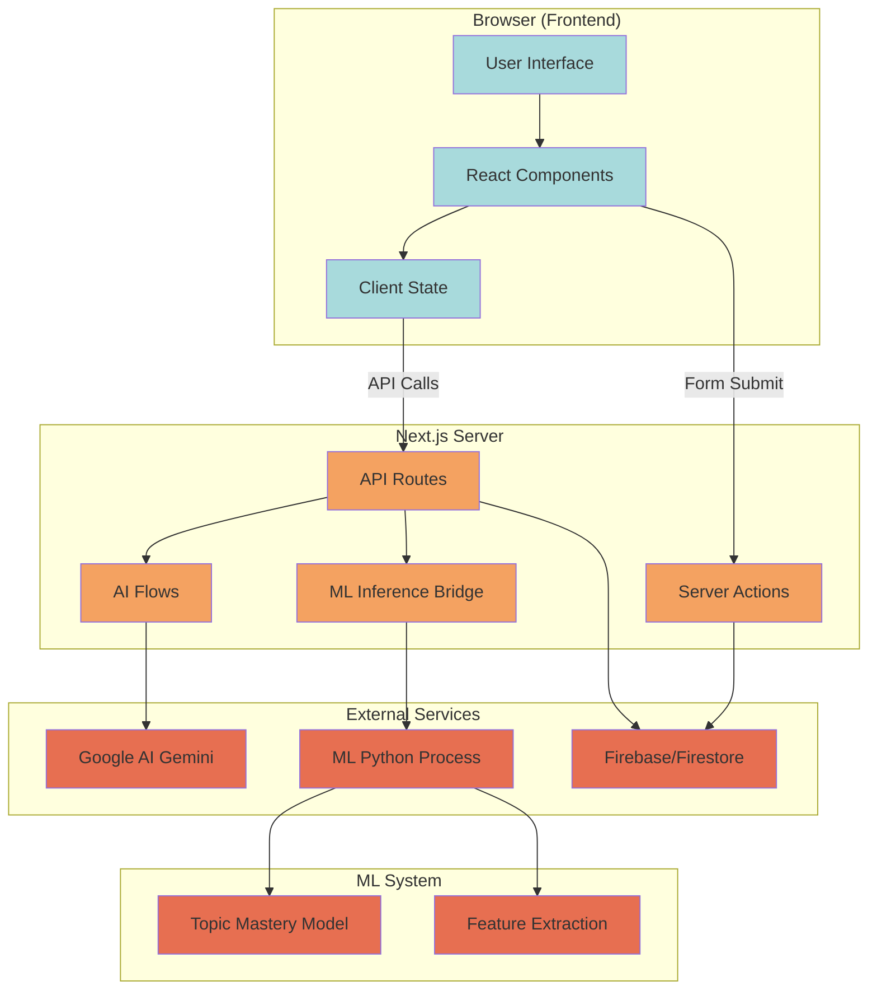

# Documentation Synchronization Report

## 1. Staleness Audit

This section lists discrepancies between documentation claims and the current codebase state.

| File | Line | Claim | Reality | Status |
|---|---|---|---|---|
| `README.md` | ~20 | "Database integration pending" | Firestore integration is implemented via `src/lib/db-helpers.ts` and `src/lib/firebase-admin.ts`. | **Outdated** |
| `src/ml/README.md` | ~85 | "Topic Mastery Prediction (Model #1)" is "In Progress" | Implemented: `src/ml/models/mastery_model.pkl` exists, `src/ml/inference/predict_mastery.py` exists. | **Outdated** |
| `src/ml/README.md` | ~86 | "Feature extraction layer" is "In Progress" | Implemented: `src/ml/features/student_features.ts` exists and is comprehensive. | **Outdated** |
| `src/ml/README.md` | ~87 | "ML-LLM integration in Revision Planner" is "In Progress" | Implemented: `src/ai/flows/smart-revision-planner.ts` uses `predictMastery` and `makeRevisionDecisions`. | **Outdated** |
| `src/ml/README.md` | ~89 | "Forgetting Curve Prediction (Model #2)" is "Planned" | Features exist in `student_features.ts`, but model file `forgetting_model.pkl` is missing. | **Planned / Partial** |
| `src/ml/README.md` | ~90 | "Attention Risk Prediction (Model #3)" is "Planned" | Features exist in `student_features.ts`, but model file `attention_model.pkl` is missing. | **Planned / Partial** |
| `ARCHITECTURE.md` | ~160 | "Replace mock data with real Firebase queries" | `src/lib/db-helpers.ts` uses real Firestore queries. Mock data exists only in `quiz-fallback.ts`. | **Partially Outdated** |

## 2. Broken Reference Inventory

Files or paths referenced in documentation that do not exist in the codebase.

| File | Referenced Path | Status |
|---|---|---|
| `src/ml/README.md` | `src/ml/models/forgetting_model.pkl` | **Missing** |
| `src/ml/README.md` | `src/ml/models/attention_model.pkl` | **Missing** |

## 3. Coverage Gaps

Features implemented in code but missing from documentation.

| Feature | Location | Description |
|---|---|---|
| **Teacher API** | `src/app/api/teacher/` | Endpoints for classes, graph data, onboarding, and student management exist but are not documented in `README.md`. |
| **Multilingual Chatbot** | `src/ai/flows/multilingual-cognitive-chatbot.ts` | A multilingual chatbot flow exists but is not mentioned in `README.md` features. |
| **Database Seeding** | `scripts/seed-database.ts` | Script for seeding Firestore with test data exists but usage is not documented in `README.md`. |
| **Quiz Fallback** | `src/lib/quiz-fallback.ts` | Fallback mechanism for quiz generation when AI fails is implemented but not documented. |

## 4. Update Proposals (Patches)

### Patch for `README.md`

```diff
<<<<<<< SEARCH
> **Status:** Production-Ready Architecture with Synthetic Data
> Complete ML → ADK → Frontend integration. Database integration pending.

## Key Features 🚀
=======
> **Status:** Production-Ready Architecture with Firestore Integration
> Complete ML → ADK → Frontend integration. Database integration complete (Firestore).

## Key Features 🚀
>>>>>>> REPLACE
<<<<<<< SEARCH
-   **Teacher Analytics** : Risk dashboards, intervention suggestions, class-level intelligence
-   **Syllabus Generator**: Retrieves official syllabi with exam strategies
-   **Adaptive Quiz Engine**: Generates questions based on weak areas
-   **Cognitive Chatbot**: An AI tutor available to answer varied queries and explain complex topics.
=======
-   **Teacher Analytics** : Risk dashboards, intervention suggestions, class-level intelligence
-   **Syllabus Generator**: Retrieves official syllabi with exam strategies
-   **Adaptive Quiz Engine**: Generates questions based on weak areas
-   **Cognitive Chatbot**: An AI tutor available to answer varied queries and explain complex topics (supports multilingual interactions).
>>>>>>> REPLACE
<<<<<<< SEARCH
### 3. Train the ML Model
```bash
# Generate synthetic training data
python generate_data.py

# Train Topic Mastery model
python train_mastery_model.py
```
This creates `src/ml/models/mastery_model.pk`l with ~75-85% accuracy.
=======
### 3. Train the ML Model
```bash
# Generate synthetic training data
python generate_data.py

# Train Topic Mastery model
python train_mastery_model.py
```
This creates `src/ml/models/mastery_model.pkl` with ~75-85% accuracy.

### 4. Seed the Database (Optional)
```bash
npm run seed-db
```
Populates Firestore with test students and quiz results.
>>>>>>> REPLACE
```

### Patch for `src/ml/README.md`

```diff
<<<<<<< SEARCH
### ✅ Implemented
- [x] ML system architecture design
- [x] Folder structure

### 🔄 In Progress
- [ ] Topic Mastery Prediction (Model #1)
- [ ] Feature extraction layer
- [ ] ML-LLM integration in Revision Planner

### 📋 Planned
- [ ] Forgetting Curve Prediction (Model #2)
- [ ] Attention Risk Prediction (Model #3)
- [ ] FastAPI microservice (production deployment)
=======
### ✅ Implemented
- [x] ML system architecture design
- [x] Folder structure
- [x] Topic Mastery Prediction (Model #1)
- [x] Feature extraction layer
- [x] ML-LLM integration in Revision Planner

### 🔄 In Progress
- [ ] Forgetting Curve Prediction (Model #2) - Features implemented
- [ ] Attention Risk Prediction (Model #3) - Features implemented

### 📋 Planned
- [ ] FastAPI microservice (production deployment)
>>>>>>> REPLACE
```

## 5. Architectural Diagram Updates

Updated Mermaid diagram reflecting current `src/ml` status and `src/app/api` endpoints.



## 6. Documentation Debt Metric

**Total Issues Identified:** 9
*   **Staleness:** 4 items
*   **Broken References:** 2 items
*   **Coverage Gaps:** 3 items

**Trend:** Baseline established. Future scans should aim to reduce this number.

## 7. Code Example Fixes

`README.md` contains a minor typo in the file path: `src/ml/models/mastery_model.pk`l -> `src/ml/models/mastery_model.pkl`. This is fixed in the proposed patch above.

`ARCHITECTURE.md` warns about mock data usage, but `src/lib/db-helpers.ts` confirms real Firestore usage. The warning should be updated to reflect that mock data is only used as a fallback (e.g. in `quiz-fallback.ts`).

Proposed update for `ARCHITECTURE.md`:

```diff
<<<<<<< SEARCH
**Critical items:**
1. ✅ Structure is already correct (you're good!)
2. ⚠️ Replace mock data with real Firebase queries
3. ⚠️ Set up authentication
=======
**Critical items:**
1. ✅ Structure is already correct (you're good!)
2. ✅ Database integration (Firestore) is complete
3. ⚠️ Set up authentication
>>>>>>> REPLACE
```
