# Distributed Tracing & Observability Infrastructure Spec

## Executive Summary
This specification details the architectural strategy for implementing end-to-end distributed tracing across the SANKALP platform. The goal is to make every request's journey through the system fully observable, enabling precise latency tracking, bottleneck detection, and cross-service error correlation.

Based on collected benchmarks, the system exhibits distinct performance characteristics:
-   **ML Inference**: Extremely fast steady-state performance (~0.7ms) but suffers from a significant cold start penalty (~2.5s).
-   **LLM Generation**: The primary latency driver (~2s), necessitating careful monitoring and cost attribution.
-   **ADK Decision Logic**: Negligible latency (<1ms), confirming its efficiency as a synchronous orchestration layer.

## Architecture & Service Boundaries

The observability pipeline spans the following boundaries where trace context must be propagated:

```mermaid
graph TD
    User[User Action] -->|Trace ID Generated| Frontend[Next.js Client]
    Frontend -->|HTTP Headers (traceparent)| ServerAction[Next.js Server Action]

    subgraph "Backend Services"
        ServerAction -->|Internal Span| MLBridge[ML Bridge (Node.js)]
        MLBridge -->|JSON Payload (_trace_id)| Python[Python Inference Process]
        ServerAction -->|Internal Span| ADK[ADK Decision Engine]
        ServerAction -->|Genkit Metadata| LLM[Genkit / LLM Provider]
        ServerAction -->|DB Call| Firestore[Firebase Firestore]
    end
```

### Trace Context Propagation

1.  **Frontend → Server Action**:
    -   **Mechanism**: W3C Trace Context (`traceparent` header).
    -   **Implementation**: Ensure `fetch` calls from client components include the header. Server Actions automatically participate if wrapped with OpenTelemetry instrumentation.

2.  **Node.js → Python Subprocess (ML Bridge)**:
    -   **Mechanism**: Explicit JSON Payload field.
    -   **Implementation**:
        -   **Node.js**: In `src/ml/inference/ml-bridge.ts`, append `_trace_id` to the input features object before writing to `stdin`.
        -   **Python**: In `src/ml/inference/predict_mastery.py`, extract `_trace_id` and start a new span with this ID as the parent context.

3.  **Node.js → LLM (Genkit)**:
    -   **Mechanism**: Metadata / Context Injection.
    -   **Implementation**: Use Genkit's telemetry hooks to attach the current active span context to the request metadata sent to the model provider (Google AI).

## Trace Instrumentation Plan

### 1. Instrumentation Setup
Update `src/instrumentation.ts` to initialize the OpenTelemetry Node.js SDK.
-   **SDK**: `@opentelemetry/sdk-node`
-   **Exporters**: OTLP Trace Exporter (sending to Jaeger/Honeycomb/etc).
-   **Auto-instrumentation**: Enable HTTP and Express instrumentations for automatic request capture.

### 2. Span Definitions & Metadata

#### A. Smart Revision Planner Flow (`src/ai/flows/smart-revision-planner.ts`)
This critical flow orchestrates multiple services.

| Span Name | Parent | Start Trigger | End Trigger | Metadata (Tags) |
| :--- | :--- | :--- | :--- | :--- |
| `revision.plan.generate` | Root | `smartRevisionPlanner` invoked | Function returns | `student_id`, `topic_count` |
| `data.fetch.history` | `revision.plan.generate` | `getStudent` call | Data returned | `history_length`, `cache_hit` |
| `topic.process` | `revision.plan.generate` | Loop start for topic | Loop end | `topic_name` |
| `feature.extraction` | `topic.process` | `extractMasteryFeatures` start | Features returned | `attempts`, `days_since_revision` |
| `ml.predict.mastery` | `topic.process` | `predictMastery` call | Prediction returned | `model_version`, `prediction_source` (API/Process) |
| `adk.decision` | `topic.process` | `makeRevisionDecision` call | Decision returned | `decision_action`, `priority` |
| `llm.generate.explanation` | `revision.plan.generate` | `explanationPrompt` call | Response received | `llm_model`, `prompt_tokens`, `completion_tokens` |

#### B. ML Bridge (`src/ml/inference/ml-bridge.ts`)
*   **Span Name**: `ml.bridge.invoke`
*   **Attributes**:
    *   `method`: `subprocess` (default) or `api` (fallback)
    *   `python_script_path`: Path to `predict_mastery.py`
    *   `retry_count`: Number of retries if failure occurred.

### 3. Python Instrumentation (`src/ml/inference/predict_mastery.py`)
*   **Span Name**: `ml.inference.python`
*   **Attributes**:
    *   `model_load_time_ms`: Time to load `.pkl` (if applicable).
    *   `inference_time_ms`: Pure model prediction time.
    *   `input_features`: JSON string of input features (for debugging).

## Performance Baseline Report

Measurements collected via `scripts/measure-latency.ts` on steady-state environment:

| Operation | P50 (Median) | P90 | P99 | Analysis |
| :--- | :--- | :--- | :--- | :--- |
| **ML Inference (Steady)** | **0.68 ms** | **~1.0 ms** | **~1.5 ms** | Extremely performant due to persistent process architecture. |
| **ML Inference (Cold)** | **2,514 ms** | N/A | N/A | High latency on first request due to Python interpreter startup and library imports (`joblib`, `sklearn`). |
| **ADK Decision** | **0.001 ms** | **0.006 ms** | **0.33 ms** | Negligible overhead; CPU-bound synchronous logic. |
| **LLM Response** | **~1,924 ms** | **~1,967 ms** | **~2,000 ms** | The dominant latency factor. |

## Bottleneck Detection & Analysis

### 1. ML Cold Start (2.5s)
*   **Root Cause**: Spawning a new Python process and importing heavy libraries (`pandas`, `sklearn`) takes significant time.
*   **Impact**: First user after deployment/restart experiences a 2-3s delay.
*   **Mitigation Strategy**:
    *   **Pre-warming**: Trigger a dummy prediction during server startup (`instrumentation.ts`).
    *   **Keep-Alive**: Ensure the persistent process doesn't exit prematurely.

### 2. LLM Latency (~2s)
*   **Root Cause**: Network RTT to Google AI and token generation time.
*   **Impact**: User perceives the application as "slow" during complex tasks like revision planning.
*   **Mitigation Strategy**:
    *   **Streaming**: Implement streaming responses for LLM outputs to improve perceived performance.
    *   **Caching**: Cache common explanations for standard topics.

## Error Correlation Strategy

Connecting failures across the Node.js / Python boundary is critical.

### Scenario: ML Prediction Failure
**Symptom**: User sees fallback logic ("Recommended based on history") instead of ML prediction.
**Trace Flow**:
1.  **Trace ID**: `a1b2c3d4` generated at Server Action.
2.  **Node.js Log**: `[Error] ML Prediction failed for trace a1b2c3d4: Python process exited with code 1`.
3.  **Python Log**: `[Error] Trace a1b2c3d4: ModuleNotFoundError: No module named 'joblib'`.
4.  **Correlation**: Searching for `trace_id=a1b2c3d4` in the logging backend (e.g., Loki, Cloud Logging) reveals both the high-level application error and the low-level Python stack trace.

## Alerting Threshold Recommendations

| Metric | Condition | Severity | Recommended Action |
| :--- | :--- | :--- | :--- |
| **Global Error Rate** | > 1% of requests | HIGH | Page On-Call. Indicates potential deployment failure or API outage. |
| **LLM Latency** | P90 > 5s for 5m | MEDIUM | Check Status Page / Switch to backup model. |
| **ML Cold Start Freq** | > 10 / hour | MEDIUM | Investigate process stability. Frequent restarts indicate crashes. |
| **Trace Duration** | P99 > 8s | LOW | Log for weekly performance review. |

## Cost Attribution Model

To enable financial observability ("FinOps"), spans must carry cost-drivers as attributes.

### 1. LLM Cost Tracking
*   **Span**: `llm.generate.explanation`
*   **Attributes**:
    *   `llm.provider`: `google-ai`
    *   `llm.model`: `gemini-1.5-flash`
    *   `llm.usage.prompt_tokens`: `150`
    *   `llm.usage.completion_tokens`: `50`
*   **Calculation**: `(prompt_tokens * $0.075/1M) + (completion_tokens * $0.30/1M)`

### 2. Database Cost Tracking
*   **Span**: `firestore.read` / `firestore.write`
*   **Attributes**:
    *   `db.collection`: `quizResults`
    *   `db.operation`: `read`
    *   `db.documents_read`: `10`
*   **Calculation**: `documents_read * $0.06/100k`

### 3. Example Cost Query
```sql
SELECT
  sum(attributes['llm.usage.prompt_tokens']) as total_input,
  sum(attributes['llm.usage.completion_tokens']) as total_output
FROM spans
WHERE service = 'sankalp-ai'
  AND attributes['student_id'] = 'student-123'
```

## Visualization: Flame Graph Concepts

### Optimised Request Flow (Warm Cache)
```mermaid
gantt
    title Request Trace: Smart Revision Plan (Warm)
    dateFormat  s
    axisFormat %S

    section Server Action
    revision.plan.generate :active, 0, 2.5

    section Processing
    ml.predict.mastery (Topic A) : 0.1, 0.101
    adk.decision (Topic A) : 0.101, 0.102
    ml.predict.mastery (Topic B) : 0.102, 0.103
    adk.decision (Topic B) : 0.103, 0.104

    section LLM
    llm.generate.explanation : 0.2, 2.2
```

### Bottleneck Request Flow (Cold Start)

```mermaid
gantt
    title Request Trace: Smart Revision Plan (Cold Start)
    dateFormat  s
    axisFormat %S

    section Server Action
    revision.plan.generate :active, 0, 5.0

    section ML Cold Start
    ml.bridge.spawn_process : 0.1, 2.6
    ml.predict.mastery : 2.6, 2.601

    section LLM
    llm.generate.explanation : 2.7, 4.7
```

