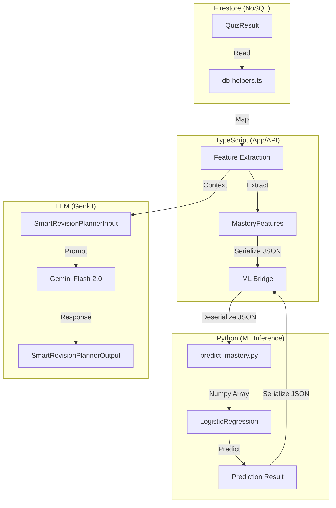

# Polyglot Type Consistency Report

## Executive Summary

This report documents the current state of type consistency across the SANKALP project, spanning Python (ML), TypeScript (Frontend/API), Firestore (Database), and LLM (Genkit) systems. It identifies critical mismatches, serialization risks, and schema evolution conflicts that threaten data integrity and reliability.

**Key Finding:** A critical Out-of-Distribution (OOD) risk was detected in the `days_since_last_revision` feature, where the application defaults to `999` for new topics, while the ML model is trained on a maximum of `30` days. This likely results in severe under-prediction of mastery for new topics.

## 1. Visual Schema Map

The following diagram illustrates the flow of data and the associated schemas at each stage.

## 2. Cross-Language Type Diff Matrix

This matrix highlights the discrepancies in type definitions and field naming conventions across the system boundaries.

| Feature / Field | Python (Training/Inference) | TypeScript (Interface) | Firestore (Document) | Mismatch / Risk |
| :--- | :--- | :--- | :--- | :--- |
| **avg_quiz_score** | `float` (0.0 - 1.0) | `number` (0.0 - 1.0) | `score` (number) | Name mismatch (mapped in code) |
| **attempts_per_topic** | `int` | `number` (int) | Count of docs | Consistent (runtime calc) |
| **days_since_last_revision** | `int` (0 - 30) | `number` (int) | Derived from `timestamp` | **CRITICAL OOD RISK** (See below) |
| **quiz_score_variance** | `float` (synthetic) | `number` (calculated) | N/A (runtime calc) | **Data Realism Risk** |
| **time_spent_per_question** | `float` (seconds) | `number` (seconds) | `timeSpent` / `questions` | Consistent |
| **student_id** | N/A (Training), `_id` (Inference) | `studentId` (camelCase) | `studentId` (camelCase) | Casing mismatch (handled manually) |
| **mastered** | `0` or `1` (int) | `boolean` (implied) | N/A | Type mismatch (int vs boolean) |

## 3. Detected Failures & Risks

### 3.1 Critical Out-of-Distribution (OOD) Risk
**Location:** `src/ml/features/student_features.ts` vs `src/ml/training/generate_data.py`
- **Issue:** The application defaults `days_since_last_revision` to `999` for new topics (where no revision history exists).
- **Training Context:** The ML model is trained on synthetic data where `days_since_last_revision` ranges from `0` to `30`.
- **Impact:** The Logistic Regression model likely learns a negative coefficient for this feature. Feeding `999` results in an extreme negative contribution ($999 \times \beta$), forcing the predicted mastery probability to near 0 regardless of other strong signals (like high quiz scores).
- **Recommendation:** Cap the default value at `30` or `60` in `student_features.ts` to stay within the model's "known world," or retrain the model with `999` included in the training set to represent "never revised".

### 3.2 Synthetic Data Mismatch
**Location:** `src/ml/training/generate_data.py`
- **Issue:** `quiz_score_variance` is generated using a heuristic based on "student ability" in the synthetic data generator. In production, it is calculated mathematically from the variance of actual quiz scores.
- **Impact:** The statistical distribution of the synthetic variance (driven by ability) may not match the distribution of calculated variance (driven by score volatility). This could lead to model bias if the relationship between variance and mastery differs in reality.

### 3.3 Serialization Fragility
**Location:** `src/ml/inference/ml-bridge.ts`
- **Issue:** The bridge relies on `stdin`/`stdout` JSON lines.
- **Risk:** If the Python script emits any non-JSON output (e.g., a `print()` for debugging or a library warning), the `JSON.parse` in Node.js will fail, potentially crashing the bridge or causing request timeouts.
- **Mitigation:** The current implementation has some filtering, but a robust solution would use a dedicated sidecar or HTTP server (FastAPI) to separate data from logs.

### 3.4 Nullability & Schema Evolution
**Location:** `src/lib/db-helpers.ts`
- **Issue:** Firestore is schema-less. `db-helpers.ts` assumes fields like `score` and `timeSpent` always exist on `QuizResult` documents.
- **Risk:** If a legacy document is missing these fields, or if a future schema change renames them, the runtime code will encounter `undefined` or `NaN` values, which propagate into the ML model as `NaN` features, causing silent prediction failures.

## 4. Schema Evolution Impact Simulation

**Scenario:** Adding a `difficulty` field to `QuizResult`.
1.  **Firestore:** Old documents lack `difficulty`. New ones have "Easy"/"Medium"/"Hard".
2.  **TypeScript:** `QuizResult` interface updated to include `difficulty?: string`.
3.  **Feature Extraction:** `extractMasteryFeatures` needs update to handle `undefined` difficulty.
4.  **ML Model:** Model expects 5 features. If we want to use `difficulty`, we must:
    -   Update `generate_data.py` to include it.
    -   Retrain model.
    -   Update `predict_mastery.py` to accept 6 features.
    -   Update `MasteryPredictionInput` in TS.
    -   Update `extractMasteryFeatures` to pass it.
    -   **Breaking Change:** The Python script will crash if TS sends 6 features but it expects 5 (or vice versa depending on implementation). `np.array` shape mismatch.

## 5. Recommended Migration Path: Schema-First Architecture

To resolve these issues and prevent future regressions, we recommend migrating to a Schema-First Architecture:

1.  **Single Source of Truth:** Define core entities (`Student`, `QuizResult`, `MasteryFeatures`) in a language-agnostic format like **Protocol Buffers (Protobuf)** or **JSON Schema**.
2.  **Code Generation:**
    -   Generate TypeScript interfaces (`.ts`) and Zod schemas automatically.
    -   Generate Python Pydantic models (`.py`) automatically.
3.  **Contract Testing:**
    -   Implement "Consumer-Driven Contracts" to verify that the TypeScript client sends exactly what the Python service expects.
4.  **Runtime Validation:**
    -   Use Zod in `ml-bridge.ts` to validate payloads *before* sending to Python.
    -   Use Pydantic in `predict_mastery.py` to validate inputs *before* processing.

## 6. Immediate Action Items

1.  **Fix OOD Bug:** Change default `days_since_last_revision` in `src/ml/features/student_features.ts` from `999` to `30`.
2.  **Harden Bridge:** Wrap `JSON.parse` in `ml-bridge.ts` with try/catch and fallback logic.
3.  **Audit Data:** Run a script to check for `QuizResult` documents missing required fields in Firestore.
