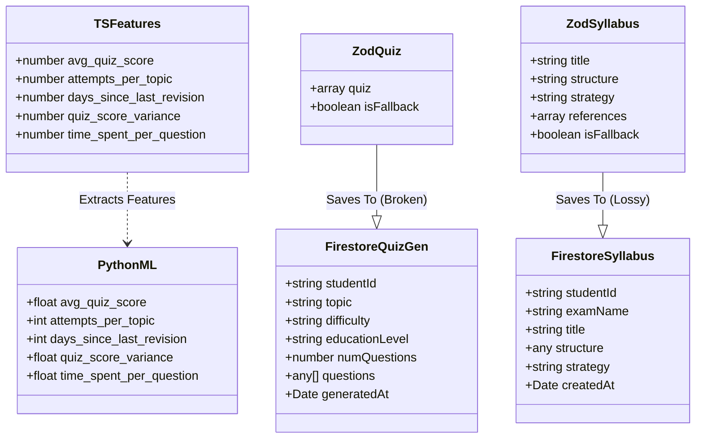

# Polyglot Type Consistency Report

**Generated By:** scripts/audit-polyglot-types.ts
**Date:** 2026-02-19T06:19:55.764Z

This report identifies structural mismatches, serialization issues, and potential data loss across the Python, TypeScript, and Firestore boundaries.

## Executive Summary
The audit detected **critical data loss** risks in the persistence layer (Quiz Questions, Syllabus References) and confirmed strict alignment in the ML Feature pipeline. It also flagged Out-of-Distribution (OOD) risks for new users.

---

## Visual Schema Map

---

## Cross-Language Type Diff Matrix

| Field | Python | TypeScript | Firestore | Zod | Status |
|---|---|---|---|---|---|
| avg_quiz_score | float | number | - | - | ✅ |
| attempts_per_topic | int | number | - | - | ✅ |
| days_since_last_revision | int | number | - | - | ✅ |
| quiz_score_variance | float | number | - | - | ✅ |
| time_spent_per_question | float | number | - | - | ✅ |
| **Quiz Data** | | | | | |
| quiz (mapped to questions) | - | - | any[] | array | ⚠️ (Loose) |
| isFallback | - | - | - | boolean | ✅ |
| studentId | - | - | string | - | ✅ |
| topic | - | - | string | - | ✅ |
| difficulty | - | - | string | - | ✅ |
| educationLevel | - | - | string | - | ✅ |
| numQuestions | - | - | number | - | ✅ |
| generatedAt | - | - | Date | - | ✅ |
| **Syllabus Data** | | | | | |
| title | - | - | string | string | ✅ |
| structure | - | - | any | string | ⚠️ (Loose Type) |
| strategy | - | - | string | string | ✅ |
| references | - | - | - | array | ❌ (Data Loss) |
| isFallback | - | - | - | boolean | ✅ |
| studentId | - | - | string | - | ✅ |
| examName | - | - | string | - | ✅ |
| createdAt | - | - | Date | - | ✅ |

---

## Detailed Findings

### ⚠️ Out-of-Distribution Risk: Default Value
**Severity:** WARN
TypeScript 'days_since_last_revision' defaults to **999** (when no history exists).
Python model was trained on range **[0, 30]**.
**Impact:** New users with no history will receive erratic predictions because 999 is far outside the training distribution.

### ✅ ML Feature Consistency
**Severity:** INFO
Python model inputs and TypeScript feature extraction outputs are perfectly aligned.

### ✅ Naming Convention: Snake Case in TypeScript
**Severity:** INFO
TypeScript uses snake_case for ML features to match Python convention: attempts_per_topic, avg_quiz_score, days_since_last_revision, quiz_score_variance, time_spent_per_question. This is acceptable for this boundary.

### ⚠️ Loose Typing: Quiz Questions
**Severity:** WARN
Firestore schema for 'QuizGeneration.questions' is defined as 'any[]'.
It should be strictly typed to match Zod schema: '{ question: string, options: string[], correctAnswer: string }[]'.

### 🔴 Data Loss: Quiz Questions Not Persisted
**Severity:** ERROR
The function 'saveQuizGeneration' is defined in 'src/lib/db-helpers.ts' but is NEVER called in the application logic (e.g., 'src/app/(main)/quiz/actions.ts').
**Impact:** Generated quizzes are ephemeral. We lose the ability to analyze question quality, difficulty, or student misconceptions later.

### 🔴 Data Loss: Syllabus Fields Dropped
**Severity:** ERROR
The following fields are generated by the AI (Zod Schema) but are missing from the Firestore schema: **references**.
**Impact:** The AI generates valuable references (URLs), but they are silently discarded when saving to the database.

### ⚠️ Loose Typing: Syllabus Structure
**Severity:** WARN
Firestore schema for 'Syllabus.structure' is defined as 'any'.
It should be strictly typed (e.g., string or structured JSON) to match Zod schema.

### ✅ Variable Naming Drift
**Severity:** INFO
**Firestore/TS:** 'timeSpent' (seconds) vs **Python:** 'time_spent_per_question' (seconds/question).
**Status:** Handled correctly in 'extractMasteryFeatures' logic.

### ✅ Statistical Naming Drift
**Severity:** INFO
**Python:** 'quiz_score_variance' (likely means StdDev based on range 0-0.5).
**TypeScript:** 'quiz_score_variance' (calculated as Math.sqrt(variance), i.e., StdDev).
**Status:** Consistent values, but variable name is mathematically slightly inaccurate (should be '_stddev').

## Recommendations

1.  **Fix Data Loss:**
    - Update `saveSyllabus` to include the `references` field.
    - Implement `saveQuizGeneration` call in `src/app/(main)/quiz/actions.ts` to persist generated quizzes.

2.  **Mitigate OOD Risk:**
    - Change default values for `days_since_last_revision` from 999 to a value within training range (e.g., 30) or update the ML model to handle outliers explicitly.

3.  **Tighten Types:**
    - Replace `any[]` in `QuizGeneration` with a strict interface.
    - Replace `any` in `Syllabus.structure` with `string` (if Markdown) or a recursive interface.

4.  **Naming:**
    - Consider renaming `quiz_score_variance` to `quiz_score_stddev` in a future refactor to align with mathematical reality.