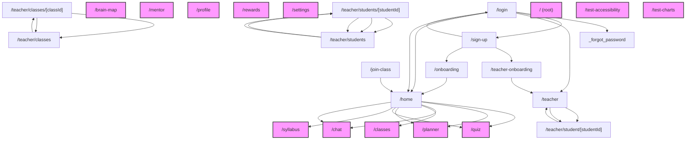

# UX Flow Entropy Report: Multi-Path Complexity Analysis

**Date:** 2026-02-19
**Scope:** Complete student and teacher user journeys in `src/app/(main)`

## Executive Summary
- **Total Pages Analyzed:** 25
- **Flow Dead Ends:** 13 (Pages requiring sidebar rescue)
- **Avg Cognitive Load:** 25.3 (Target < 50)
- **Avg Decision Entropy:** 0.24 bits (Target ~3 bits)
- **Avg Attention Cost:** 56 (Budget: Desktop 100, Mobile 50)

## 1. Interactive Flow Graph (Mermaid)

## 2. Cognitive Load Heatmap
Formula: (Words / 50) + (Decisions * 2). Target < 50.

| Page | Score | Words | Interactive Elements | Status |
|---|---|---|---|---|
| `/teacher/classes` | 75.2 | 962 | 28 | 🟠 Warning |
| `/teacher/students` | 71.3 | 763 | 28 | 🟠 Warning |
| `/quiz` | 48.0 | 598 | 18 | 🟢 Optimal |
| `/onboarding` | 47.2 | 862 | 15 | 🟢 Optimal |
| `/home` | 40.8 | 441 | 16 | 🟢 Optimal |
| `/chat` | 36.7 | 433 | 14 | 🟢 Optimal |
| `/teacher-onboarding` | 36.5 | 723 | 11 | 🟢 Optimal |
| `/settings` | 31.9 | 194 | 14 | 🟢 Optimal |
| `/teacher/classes/[classId]` | 30.4 | 619 | 9 | 🟢 Optimal |
| `/syllabus` | 29.4 | 570 | 9 | 🟢 Optimal |
| `/sign-up` | 25.1 | 356 | 9 | 🟢 Optimal |
| `/login` | 24.6 | 328 | 9 | 🟢 Optimal |
| `/test-accessibility` | 21.6 | 79 | 10 | 🟢 Optimal |
| `/teacher/students/[studentId]` | 21.4 | 472 | 6 | 🟢 Optimal |
| `/classes` | 16.5 | 425 | 4 | 🟢 Optimal |

## 3. Decision Entropy Analysis (Analysis Paralysis)
Pages with high entropy (> 3.5 bits / > 11 choices) indicate too many choices without guidance.

| Page | Entropy (bits) | Distinct Choices |
|---|---|---|

## 4. Path Efficiency Matrix
### Student Journey (From /home)
| Goal | Steps | Status |
|---|---|---|
| `/quiz` | 1 | ✅ Efficient |
| `/planner` | 1 | ✅ Efficient |
| `/syllabus` | 1 | ✅ Efficient |
| `/rewards` | 1 | ✅ Efficient |

### Teacher Journey (From /teacher)
| Goal | Steps | Status |
|---|---|---|
| `/teacher/students` | 1 | ✅ Efficient |
| `/teacher/classes` | 1 | ✅ Efficient |

## 5. Dead-End Inventory
Pages with no explicit forward navigation (traps users who miss the sidebar).

| Page | Recommended Escape |
|---|---|
| `/brain-map` | Add 'Back' button or primary CTA |
| `/chat` | Add 'Back' button or primary CTA |
| `/classes` | Add 'Back' button or primary CTA |
| `/mentor` | Add 'Back' button or primary CTA |
| `/planner` | Add 'Back' button or primary CTA |
| `/profile` | Add 'Back' button or primary CTA |
| `/quiz` | Add 'Back' button or primary CTA |
| `/rewards` | Add 'Back' button or primary CTA |
| `/settings` | Add 'Back' button or primary CTA |
| `/syllabus` | Add 'Back' button or primary CTA |
| `/` | Add 'Back' button or primary CTA |
| `/test-accessibility` | Add 'Back' button or primary CTA |
| `/test-charts` | Add 'Back' button or primary CTA |

## 6. Attention Budget Violations
Pages exceeding attention budget (Desktop > 100, Mobile > 50).
Cost: Button=1, Paragraph=5, Input=2, Chart=10.

| Page | Cost | Violation Type |
|---|---|---|
| `/teacher/classes` | 142 | 🔴 Desktop & Mobile |
| `/teacher/students` | 128 | 🔴 Desktop & Mobile |
| `/onboarding` | 100 | 🟠 Mobile Only |
| `/rewards` | 90 | 🟠 Mobile Only |
| `/quiz` | 86 | 🟠 Mobile Only |
| `/teacher-onboarding` | 82 | 🟠 Mobile Only |
| `/teacher/classes/[classId]` | 72 | 🟠 Mobile Only |
| `/syllabus` | 69 | 🟠 Mobile Only |
| `/chat` | 66 | 🟠 Mobile Only |
| `/teacher` | 57 | 🟠 Mobile Only |

## 7. Mobile-Desktop Flow Divergence
Pages with significant responsive visibility changes (hidden elements).

No significant flow divergence detected.

## 8. Prioritized UX Improvement Backlog

1. **[CRITICAL] Fix Dead End on `/brain-map`**: User is trapped. Add explicit navigation.
2. **[CRITICAL] Fix Dead End on `/chat`**: User is trapped. Add explicit navigation.
3. **[CRITICAL] Fix Dead End on `/classes`**: User is trapped. Add explicit navigation.
4. **[CRITICAL] Fix Dead End on `/mentor`**: User is trapped. Add explicit navigation.
5. **[CRITICAL] Fix Dead End on `/planner`**: User is trapped. Add explicit navigation.
6. **[CRITICAL] Fix Dead End on `/profile`**: User is trapped. Add explicit navigation.
7. **[CRITICAL] Fix Dead End on `/quiz`**: User is trapped. Add explicit navigation.
8. **[CRITICAL] Fix Dead End on `/rewards`**: User is trapped. Add explicit navigation.
9. **[CRITICAL] Fix Dead End on `/settings`**: User is trapped. Add explicit navigation.
10. **[CRITICAL] Fix Dead End on `/syllabus`**: User is trapped. Add explicit navigation.
11. **[CRITICAL] Fix Dead End on `/`**: User is trapped. Add explicit navigation.
12. **[CRITICAL] Fix Dead End on `/test-accessibility`**: User is trapped. Add explicit navigation.
13. **[CRITICAL] Fix Dead End on `/test-charts`**: User is trapped. Add explicit navigation.
