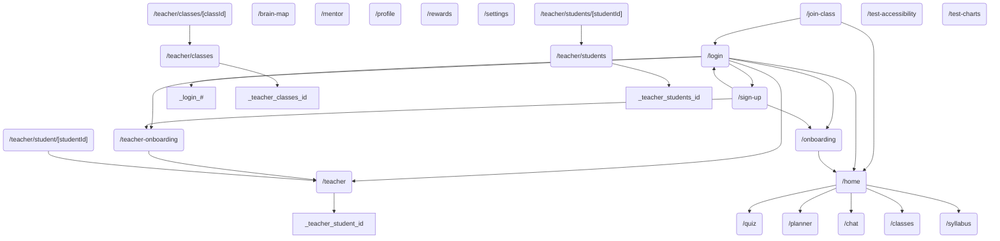

# UX Flow Entropy Report

## Overview
- **Total Pages**: 25
- **Total Transitions Detected**: 37

## Interactive Flow Graph (Mermaid)

## Cognitive Load Analysis
| Page | Word Count | Interactive Elements | Load Score | Status |
|------|------------|----------------------|------------|--------|
| `/teacher/classes` | 623 | 25 | 50.0 | High |
| `/teacher/students` | 481 | 25 | 47.1 | High |
| `/home` | 277 | 16 | 29.5 | High |
| `/quiz` | 315 | 15 | 28.8 | High |
| `/settings` | 96 | 14 | 22.9 | Optimal |
| `/chat` | 219 | 12 | 22.4 | Optimal |
| `/onboarding` | 523 | 7 | 21.0 | Optimal |
| `/login` | 240 | 9 | 18.3 | Optimal |
| `/syllabus` | 346 | 7 | 17.4 | Optimal |
| `/teacher/classes/[classId]` | 390 | 6 | 16.8 | Optimal |
| `/test-accessibility` | 41 | 10 | 15.8 | Optimal |
| `/teacher-onboarding` | 384 | 5 | 15.2 | Optimal |
| `/sign-up` | 142 | 8 | 14.8 | Optimal |
| `/teacher/students/[studentId]` | 302 | 4 | 12.0 | Optimal |
| `/teacher` | 305 | 3 | 10.6 | Optimal |
| `/classes` | 277 | 3 | 10.0 | Optimal |
| `/join-class` | 130 | 3 | 7.1 | Optimal |
| `/planner` | 24 | 4 | 6.5 | Optimal |
| `/mentor` | 143 | 2 | 5.9 | Optimal |
| `/` | 245 | 0 | 4.9 | Optimal |
| `/rewards` | 213 | 0 | 4.3 | Optimal |
| `/teacher/student/[studentId]` | 38 | 2 | 3.8 | Optimal |
| `/brain-map` | 154 | 0 | 3.1 | Optimal |
| `/test-charts` | 66 | 0 | 1.3 | Optimal |
| `/profile` | 35 | 0 | 0.7 | Optimal |

## Decision Entropy (Analysis Paralysis Risks)
Pages with high branching factors (> 5 choices) causing potential decision fatigue.

| Page | Entropy | Choices |
|------|---------|---------|
| `/login` | 3.32 | 10 |
| `/home` | 3.00 | 8 |

## Mobile vs. Desktop Divergence
Pages with high usage of responsive modifiers (`md:`, `lg:`, `hidden`), indicating complex adaptive layouts.

| Page | Responsive Class Count | Complexity |
|------|------------------------|------------|
| `/rewards` | 10 | Moderate |
| `/chat` | 8 | Moderate |
| `/home` | 6 | Moderate |
| `/teacher/students` | 6 | Moderate |
| `/classes` | 5 | Moderate |
| `/teacher/classes/[classId]` | 5 | Moderate |
| `/teacher/classes` | 5 | Moderate |
| `/onboarding` | 4 | Moderate |
| `/teacher-onboarding` | 4 | Moderate |
| `/brain-map` | 3 | Moderate |
| `/mentor` | 3 | Moderate |
| `/profile` | 3 | Moderate |
| `/settings` | 3 | Moderate |
| `/syllabus` | 3 | Moderate |
| `/teacher` | 3 | Moderate |
| `/teacher/students/[studentId]` | 3 | Moderate |

## Dead-End Detection
Pages with no detected outgoing internal links (risk of abandonment).

- `/brain-map`
- `/chat`
- `/classes`
- `/mentor`
- `/planner`
- `/profile`
- `/quiz`
- `/rewards`
- `/settings`
- `/syllabus`
- `/`
- `/test-accessibility`
- `/test-charts`

## Path Efficiency & Missing Links
*Based on static analysis of `href` and `router.push`*

### Goal: Quiz -> Revision
- **Check**: Does `/quiz` lead to `/planner`?
- **Result**: ❌ Broken Flow (Critical Bug)

### Goal: Teacher Dashboard -> Intervention
- **Check**: Does `/teacher` lead to Intervention Actions?
- **Result**: ✅ Actions Found

## Recommendations
1. **Fix Dead Ends**: Ensure all pages have a clear "Next Step" or "Back" button.
2. **Reduce Load**: Pages with "Overload" status should be split or simplified.
3. **Clarify Choices**: High entropy pages should group options or highlight a primary call-to-action.
4. **Mobile Optimization**: Review pages with "High" complexity to ensure mobile experience is not compromised.
