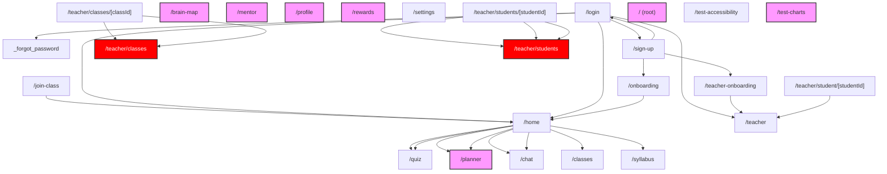

# UX Flow Entropy Report: Multi-Path Complexity Analysis

**Date:** 2026-02-18
**Scope:** Complete student and teacher user journeys in `src/app/(main)`

## Executive Summary
- **Total Pages Analyzed:** 25
- **Dead Ends Detected:** 7
- **Avg Cognitive Load:** 36.32 (Target < 50)
- **Avg Decision Entropy:** 3.05 bits (Target ~3 bits)

## 1. Interactive Flow Graph (Mermaid)

## 2. Cognitive Load Heatmap (Top 10 High Load)
| Page | Score | Words | Interactive Elements | Status |
|---|---|---|---|---|
| `/teacher/classes` | 104.1 | 962 | 28 | 🔴 Overload |
| `/teacher/students` | 94.2 | 763 | 28 | 🔴 Overload |
| `/onboarding` | 73.1 | 862 | 15 | qh Warning |
| `/quiz` | 63.9 | 598 | 17 | qh Warning |
| `/teacher-onboarding` | 58.1 | 723 | 11 | qh Warning |
| `/home` | 54.0 | 441 | 16 | qh Warning |
| `/chat` | 49.7 | 433 | 14 | 🟢 Optimal |
| `/teacher/classes/[classId]` | 49.0 | 619 | 9 | 🟢 Optimal |
| `/syllabus` | 42.5 | 570 | 7 | 🟢 Optimal |
| `/teacher/students/[studentId]` | 35.6 | 472 | 6 | 🟢 Optimal |

## 3. Decision Entropy Analysis (Analysis Paralysis)
Pages with high entropy (> 3.5 bits) indicate too many choices without guidance.

| Page | Entropy (bits) | Choices (Implicit + Explicit) |
|---|---|---|
| `/login` | 3.70 | 13 |
| `/sign-up` | 3.70 | 13 |
| `/join-class` | 3.32 | 10 |
| `/onboarding` | 3.32 | 10 |
| `/profile` | 3.32 | 10 |
| `/` | 3.32 | 10 |
| `/test-accessibility` | 3.32 | 10 |
| `/test-charts` | 3.32 | 10 |
| `/brain-map` | 3.17 | 10 |
| `/chat` | 3.17 | 10 |

## 4. Path Efficiency Matrix
### Student Journey (From /home)
| Goal | Steps | Status |
|---|---|---|
| `/quiz` | 1 | ✅ Efficient |
| `/planner` | 1 | ✅ Efficient |
| `/syllabus` | 1 | ✅ Efficient |

### Teacher Journey (From /teacher)
| Goal | Steps | Status |
|---|---|---|
| `/teacher/interventions` | -1 | ❌ Unreachable |
| `/teacher/analytics` | -1 | ❌ Unreachable |

## 5. Dead-End Inventory
Pages with no explicit forward navigation (traps users).

| Page | Recommended Escape |
|---|---|
| `/brain-map` | Add 'Back' button or primary CTA |
| `/mentor` | Add 'Back' button or primary CTA |
| `/planner` | Add 'Back' button or primary CTA |
| `/profile` | Add 'Back' button or primary CTA |
| `/rewards` | Add 'Back' button or primary CTA |
| `/` | Add 'Back' button or primary CTA |
| `/test-charts` | Add 'Back' button or primary CTA |

## 6. Attention Budget Violations
Pages exceeding attention budget (> 100 points).

| Page | Cost | Violation Source |
|---|---|---|
| `/rewards` | 180 | Too many elements/charts |
| `/teacher/classes` | 114 | Too many elements/charts |

## 7. Mobile-Desktop Flow Divergence
Pages with responsive visibility classes on interactive elements.

No significant flow divergence detected.

## 8. Prioritized UX Improvement Backlog

1. **[CRITICAL] Fix Dead End on `/brain-map`**: User is trapped. Add explicit navigation.
2. **[CRITICAL] Fix Dead End on `/mentor`**: User is trapped. Add explicit navigation.
3. **[CRITICAL] Fix Dead End on `/planner`**: User is trapped. Add explicit navigation.
4. **[CRITICAL] Fix Dead End on `/profile`**: User is trapped. Add explicit navigation.
5. **[CRITICAL] Fix Dead End on `/rewards`**: User is trapped. Add explicit navigation.
6. **[CRITICAL] Fix Dead End on `/`**: User is trapped. Add explicit navigation.
7. **[CRITICAL] Fix Dead End on `/test-charts`**: User is trapped. Add explicit navigation.
8. **[HIGH] Reduce Cognitive Load on `/teacher/classes`**: Score 104. Break content into chunks or steps.
9. **[HIGH] Reduce Cognitive Load on `/teacher/students`**: Score 94. Break content into chunks or steps.
10. **[MEDIUM] Fix Unreachable Goal `/teacher/interventions`**: No path found from entry point.
11. **[MEDIUM] Fix Unreachable Goal `/teacher/analytics`**: No path found from entry point.
