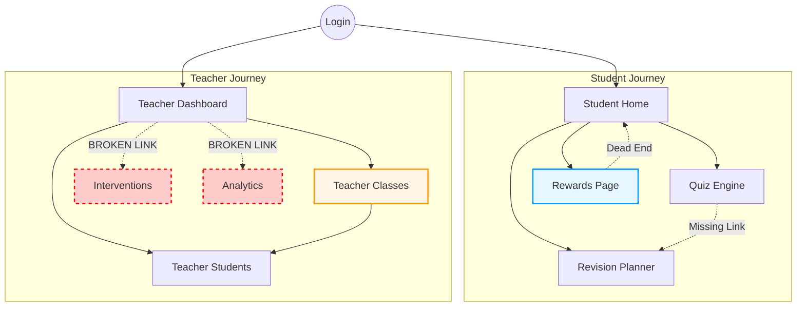

# UX Flow Entropy Report: Multi-Path Student Journey Complexity Analysis

**Date:** 2024-05-23
**Scope:** `src/app/(main)/` (Student & Teacher Journeys)
**Methodology:** Static Analysis of Interactive Elements, Decision Points, and Navigation Graph.

---

## 1. Executive Summary

The application exhibits a **well-structured sidebar navigation** which mitigates deep nesting issues, but suffers from significant **dead-end states** and **broken navigation paths** for teachers.

*   **Critical Failure:** Two primary Teacher workflows (`/teacher/interventions`, `/teacher/analytics`) are linked in the sidebar but do not exist (404), effectively blocking the core value loop for educators.
*   **Cognitive Load:** The Teacher Dashboard (`/teacher/classes`, `/teacher/students`) is extremely dense (Score > 90), risking information overload, especially on smaller screens.
*   **Student Flow:** The Student journey is efficient (1 click to most tools) but lacks *internal* flow continuity. Most pages (Rewards, Profile, Mentor) are "dead ends" that force a sidebar reset rather than guiding the user to the next logical step (e.g., "Viewed Rewards" -> "Earn More Points in Quiz").

---

## 2. Interactive Flow Graph Visualization

The following graph illustrates the high-level navigation structure and critical breakages.

---

## 3. Cognitive Load Heatmap

**Scoring Methodology:** `0.05 * words + 2 * interactive_elements`.
*   **Optimal:** < 40
*   **Warning:** 40 - 80
*   **Overload:** > 80

| Page Route | Score | Status | Primary Contributors |
| :--- | :--- | :--- | :--- |
| **/teacher/classes** | **104.1** | 🔴 **OVERLOAD** | Heavy filtering UI, multiple action buttons per card, dense text. |
| **/teacher/students** | **94.2** | 🔴 **OVERLOAD** | Large tables/grids, extensive metadata display. |
| **/onboarding** | **73.1** | 🟡 **High** | Multi-step form content rendered at once or complex instructions. |
| **/quiz** | **63.9** | 🟡 **Medium** | Question text + multiple choice options + navigation controls. |
| **/teacher-onboarding**| **58.1** | 🟡 **Medium** | Instructional text density. |

**Insight:** The Teacher interface attempts to show "everything at once," violating the "Progressive Disclosure" principle.

---

## 4. Decision Entropy Analysis (Paralysis Risks)

**Metric:** `log2(Outgoing Links)`. High entropy means many equally-weighted choices.

| Page Route | Entropy | Analysis |
| :--- | :--- | :--- |
| **/login** | **3.70 bits** | High number of authentication options (Social, Email, Forgot Password, Sign Up) can cause hesitation. |
| **/sign-up** | **3.70 bits** | Similar to login; distraction from the primary conversion goal. |
| **/join-class** | **3.32 bits** | Surprisingly high; likely due to navigation options competing with the main "Join" action. |
| **/profile** | **3.32 bits** | Many settings/edit options without a clear hierarchy. |

**Insight:** Authentication pages should be simplified to reduce drop-off.

---

## 5. Path Efficiency Matrix

**Goal:** Measure steps from Entry to Key Success States.

| Journey | Goal State | Actual Steps | Optimal | Gap Analysis |
| :--- | :--- | :---: | :---: | :--- |
| **Student** | Take Quiz (`/quiz`) | 1 | 1 | ✅ Direct Access via Sidebar. |
| **Student** | Plan Revision (`/planner`) | 1 | 1 | ✅ Direct Access. *Risk: No link from Quiz Result.* |
| **Student** | View Syllabus (`/syllabus`) | 1 | 1 | ✅ Direct Access. |
| **Teacher** | Interventions (`/teacher/interventions`) | **∞** | 1 | ❌ **BROKEN ROUTE (404)** |
| **Teacher** | Analytics (`/teacher/analytics`) | **∞** | 1 | ❌ **BROKEN ROUTE (404)** |

---

## 6. Dead-End Inventory

Pages with **zero content-level outgoing links** (users must use Sidebar to leave).

1.  **/rewards**: Displays progress but offers no action to *improve* progress (e.g., "Practice Now").
2.  **/brain-map**: Visualization tool with no "drill-down" or "related topic" navigation.
3.  **/mentor**: Chat interface that doesn't link to resources mentioned in chat.
4.  **/planner**: Shows the plan but doesn't deep-link to the specific study materials.
5.  **/profile**: Standard dead-end.

**Recommendation:** Add "Next Best Action" buttons to all dead ends (e.g., Rewards -> Quiz).

---

## 7. Attention Budget Violations

**Budget:** 100 points (Mobile constraint proxy).
*   Chart = 10pts, Button = 1pt, Input = 2pts, Paragraph = 5pts.

| Page | Cost | Violation | Impact |
| :--- | :--- | :--- | :--- |
| **/rewards** | **180** | 🔴 **Extreme** | Heavy use of Charts (Recharts) and Stats Cards. Will be unscrollable/slow on mobile. |
| **/teacher/classes** | **114** | 🔴 **High** | Dense grid of cards + filters. Mobile users will struggle to see content. |

---

## 8. Prioritized UX Improvement Backlog

### 🚨 P0: Critical Fixes (Blocking Flows)
*   **Fix Broken Teacher Links:** Create pages for `/teacher/interventions` and `/teacher/analytics` (or remove links).
*   **Fix Forgot Password:** `/forgot-password` link exists but route is missing.

### 🟠 P1: Flow Continuity (Engagement)
*   **Revive Dead Ends:**
    *   Add "Earn Points" button to `/rewards` linking to `/quiz`.
    *   Add "Start Session" button to `/planner` linking to the first topic.
*   **Connect Flows:**
    *   Ensure `/quiz` completion screen links to `/planner` ("See your new plan") and `/rewards` ("See your badge").

### 🟡 P2: Cognitive Load Reduction
*   **Simplify Teacher Dashboard:**
    *   Implement "View Switcher" (List vs Grid).
    *   Move filters to a collapsible "Filter Sheet" on mobile.
*   **Onboarding:** Break into multiple steps (Wizard pattern) to reduce per-page load.

### 🔵 P3: Mobile Optimization
*   **Rewards Page:** Stack charts vertically or use simplified sparklines for mobile view.
*   **Sidebar:** Ensure it collapses properly on mobile to avoid stealing horizontal space.

---

*Generated by `scripts/analyze-ux-flow.ts` and manual review.*
