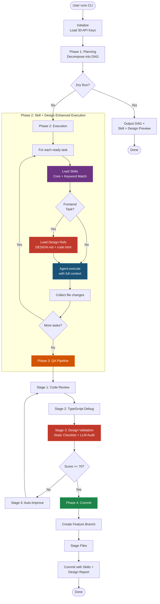

# CLI and Usage Instructions

The orchestration system acts as an independent application accessible via `src/index.ts`. Command Line interface is built cleanly via `Commander.js`.

## Local Setup
1. **Install dependencies**: Navigate to the `agents/` folder and run `npm install`.
2. **Configure Keys**: Map `cp .env.agents.example .env.agents`. Fill up to 30 API keys inside the configuration block.
3. **Verify Skills**: Ensure the `skills/` directory is populated with `SKILL.md` files — agents will load these dynamically.
4. **Verify Design Assets**: Ensure `agents/design/` contains the 22 screen folders — each with `DESIGN.md`, `code.html`, and `screen.png`. The Frontend Agent and Visual Validator will load these automatically.

## Supported Commands

```mermaid
graph LR
    CLI["npx tsx src/index.ts"] --> Run("run 'Task'")
    CLI --> DryRun("--dry-run 'Task'")
    CLI --> Status("status")
    CLI --> Pool("pool")
    CLI --> Wiki("wiki")
    CLI --> Skills("skills")

    Run -.-->|Executes| Pipe[Full Pipeline<br/>Plan + Skills + Design + Execute + QA + Commit]
    DryRun -.-->|Verifies| Plan[Task DAG + Skill<br/>+ Design Resolution Preview]
    Status -.-->|Reads| Tasks[tasks.md Completions]
    Pool -.-->|Monitors| API[API Key Telemetry]
    Wiki -.-->|Reads| Map[Context Engine Maps]
    Skills -.-->|Lists| SM[Skill Manifest<br/>per Agent Role]

    style Run fill:#1E8449,stroke:#27AE60,color:#fff
    style Skills fill:#6C3483,stroke:#A569BD,color:#fff
```

### Run Pipeline (Autonomous Development)
Executes a task autonomously. Creates a branch, loads skills, resolves design references, plans the code, generates it, validates design compliance, and auto-commits with skills traceability.
```bash
npx tsx src/index.ts run "Build the student portfolio dashboard"
```

Example output includes:
```
[orchestrator] Task: "Build the student portfolio dashboard"
[orchestrator] Keys loaded: 28/30
[system]       ─── Planning Phase ───
[planner]      Plan: 6 subtasks created
[system]       ─── Execution Phase ───
[frontend]     🎨 Starting: Build dashboard page
[frontend]     🎨 Design refs loaded: Student Dashboard
[frontend]     🎨 Skills loaded: design-system-sankalp, react-best-practices, nextjs-app-router-patterns, tailwind-patterns, frontend-design, threejs-fundamentals
[frontend]     🎨 Generated 4 frontend files
[backend]      ⚙️ Starting: Build portfolio API routes
[backend]      ⚙️ Skills loaded: typescript-expert, nodejs-backend-patterns, api-design-principles, firebase, zod-validation-expert
[backend]      ⚙️ Generated 3 backend files
[system]       ─── Quality Assurance Pipeline ───
[visual_valid] 👁️ Design checklist: all rules passed ✅
[visual_valid] 👁️ Design spec loaded for LLM: Student Dashboard
[reviewer]     ✅ Review passed (score: 87/100)
[orchestrator] Committed to agent/build-student-portfolio: a3f8b2c1
```

### Design Validation Output
When design violations are detected, the visual validator reports them:
```
[visual_valid] 👁️ Design checklist: 2 violation(s) — No hard 1px solid borders, Neumorphic shadows present
[visual_valid] 👁️ Design spec loaded for LLM: Student Dashboard
[reviewer]     ❌ Review failed — design violations detected
[improve]      🔧 Fixing: Replacing border: 1px solid with neumorphic-flat shadows
[visual_valid] 👁️ Design checklist: all rules passed ✅
[reviewer]     ✅ Review passed (score: 82/100)
```

### Dry Run Strategy
Used to verify the Orchestrator's internal Task DAG strategy without writing code. This lets a human review the `Planner` logic, **which skills would be loaded**, and **which design references would be injected** for each agent.
```bash
npx tsx src/index.ts run --dry-run "Implement Pytest framework"
```
Or shorthand:
```bash
npx tsx src/index.ts --dry-run "Implement Pytest framework"
```

### Skill Manifest
View which skills each agent has access to:
```bash
npx tsx src/index.ts skills
```
Output:
```
─── Skill Manifest ───
frontend:
  Core: design-system-sankalp, react-best-practices, nextjs-app-router-patterns, tailwind-patterns, frontend-design, threejs-fundamentals
  Supplementary: react-state-management, threejs-materials, threejs-postprocessing, animejs-animation, ...

visual_validator:
  Core: design-system-sankalp, code-review-checklist
  Supplementary: vibe-code-auditor

backend:
  Core: typescript-expert, nodejs-backend-patterns, api-design-principles, firebase, zod-validation-expert
  Supplementary: auth-implementation-patterns, error-handling-patterns, api-security-best-practices, ...
```

### Tracking Pools and Projects
- **System Status:** `npx tsx src/index.ts status` — Parses the `tasks.md` skeleton block dynamically outputting visual completions across the 30-day build.
- **API Status:** `npx tsx src/index.ts pool` — Outputs telemetry on the 30 API keys: Tokens burned, total calls handled, availability status.
- **Wiki Verification:** `npx tsx src/index.ts wiki` — Outputs all recognized Context Engine indexed mapping files.

## Reports and File Operations
All file diffs that modify source code originate directly at the target paths inside `SANKALP-AEI/`. To safeguard the dev process:
- Backups of modified files are sent to `agents/output/diffs/`
- Markdown run reports are logged in `agents/output/reports/`
- Reports now include a **Skills Injected** section showing exactly which `SKILL.md` files were consumed by each agent
- Reports include a **Design References** section for frontend tasks showing which screen designs were loaded

## Design System Compliance Checklist

The Visual Validator automatically runs an 8-point static checklist on all generated frontend files:

| # | Rule | What It Checks |
|---|------|---------------|
| 1 | Manrope font | Headlines use the Manrope font family |
| 2 | Inter font | Body text uses the Inter font family |
| 3 | Primary color token | Uses `#702ae1`, not generic purple |
| 4 | No generic colors | No `bg-blue-*`, `bg-red-*`, `bg-green-*` Tailwind classes |
| 5 | No-Line Rule | No `border: 1px solid` for containment |
| 6 | Neumorphic shadows | Uses `neumorphic-flat` / `neumorphic-inset` classes |
| 7 | Rounded corners | All containers have `rounded-*` classes |
| 8 | CTA gradient | Primary buttons use gradient from primary to primary-container |

## Pipeline Execution Diagram


