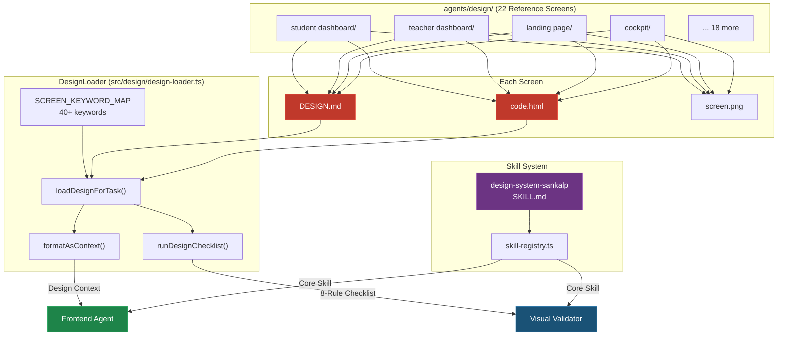
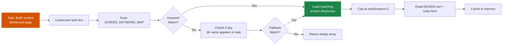
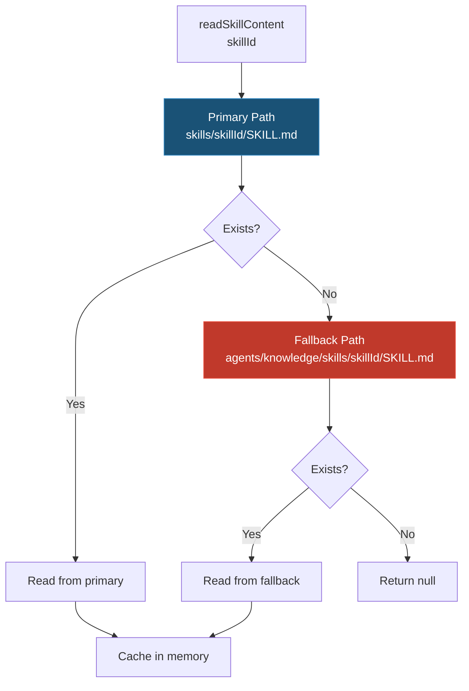
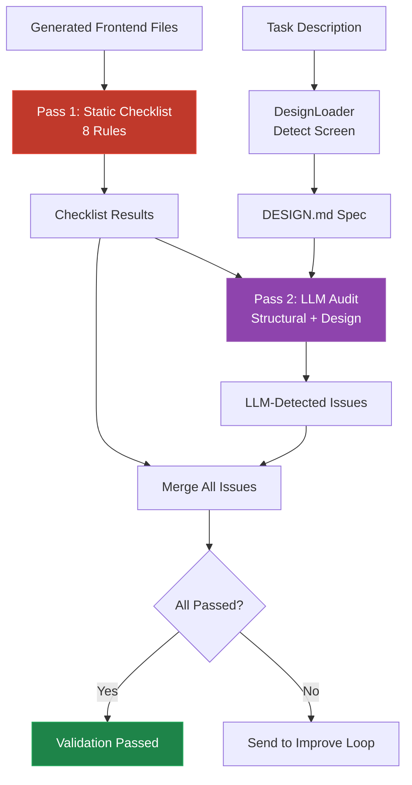

# Design System Integration

The SANKALP-AEI agent system includes a full design-system integration layer that ensures generated frontend code adheres to the **"Cognitive Architect"** design language — a premium educational UI built on neumorphism, glassmorphism, and tonal layering.

## Architecture

## Components

### 1. Design Asset Library (`agents/design/`)

Contains **22 reference screen designs**, each with three files:

| File | Purpose | Size |
|------|---------|------|
| `DESIGN.md` | Design specification — colors, typography, spacing, component patterns, the "Cognitive Architect" rules | 2–4 KB |
| `code.html` | Pixel-accurate Tailwind/HTML reference implementation generated by the design team | 15–40 KB |
| `screen.png` | Visual reference screenshot | Image |

### Screen Inventory

| Screen | Directory | Primary Keywords |
|--------|-----------|-----------------|
| AI Companion | `aicompanion/` | ai companion, ai tutor, companion |
| Class Overview | `class overview/` | class overview, class view |
| Cockpit | `cockpit/` | cockpit, admin |
| Config | `config/` | config, configuration, settings |
| Forgot Password | `forgot password/` | forgot password, reset password |
| Help Center | `help center/` | help center, help, support |
| Landing Page | `landing page/` | landing, landing page, home page |
| Lesson Planning | `lesson planning/` | lesson planning, lesson plan |
| Metacognition | `metacognition/` | metacognition |
| Registration | `registration/` | login, sign up, register |
| Student Analytics | `student analytics/` | student analytics |
| Student Dashboard | `student dashboard/` | student dashboard, dashboard |
| Student Drill Down | `student drill down/` | student drill, drill down |
| Student Profile | `student profile/` | student profile |
| Study Session | `study session/` | study session |
| System Health | `systemhealth/` | system health, system monitor |
| Teacher Dashboard | `teacher dashboard/` | teacher dashboard |
| Teacher Profile | `teacher profile/` | teacher profile |
| Teacher Report | `teacher report/` | teacher report |
| User Management | `user management/` | user management, user admin |

### 2. Design Loader (`src/design/design-loader.ts`)

The `DesignLoader` class is the runtime bridge between the static design assets and the agent system.

**API Surface:**
- `loadDesignForTask(taskDescription, maxScreens)` — Detects screen(s) from task keywords, returns loaded assets
- `loadScreen(screenDir)` — Loads a specific screen by directory name
- `formatAsContext(assets, includeHtml, maxHtmlChars)` — Formats assets as prompt-ready markdown
- `runDesignChecklist(generatedCode)` — Runs 8 static compliance rules on generated code
- `formatChecklistResults(items)` — Formats checklist as a human-readable pass/fail report
- `listScreenDirs()` — Lists all available screen directories

**Keyword Resolution Flow:**

### 3. Design System Skill (`agents/knowledge/skills/design-system-sankalp/SKILL.md`)

A consolidated SKILL.md that captures the complete "Cognitive Architect" design system:

- **Color Tokens** — 25+ Material Design 3 tokens with hex values
- **No-Line Rule** — Strict mandate: no 1px solid borders for containment
- **Neumorphic Shadow System** — `neumorphic-flat`, `neumorphic-inset`, `neumorphic-pressed` CSS classes
- **Typography** — Manrope (headlines) + Inter (body), with size/weight tables
- **Glassmorphism** — Floating elements recipe with blur + saturate + glass edge
- **Component Patterns** — Buttons, icon circles, cards, inputs, progress bars, mastery arc
- **Spacing & Layout** — Card padding, section gaps, grid system
- **Border Radius** — Minimum 1rem on all visible containers
- **Tailwind Config** — Complete theme extension for token colors, fonts, radii

This skill is loaded as a **core skill** for both the Frontend Agent and Visual Validator.

### 4. Skill Loader Dual-Path Resolution (`src/skills/skill-loader.ts`)

The `SkillLoader` now searches two locations for SKILL.md files:

### 5. Visual Validation Pipeline (`src/core/reviewer.ts`)

Stage 3 of the Reviewer Pipeline now performs a **two-pass design-aware audit**:

**Pass 1: Static Design Checklist (Zero LLM Cost)**

| # | Rule | Regex/Pattern Check |
|---|------|-------------------|
| 1 | Manrope font imported | `/Manrope/i` |
| 2 | Inter font imported | `/Inter/i` |
| 3 | Primary token used | `/#702ae1\|text-primary\|bg-primary/i` |
| 4 | No generic colors | Absence of `bg-blue-*`, `bg-red-*`, `bg-green-*` |
| 5 | No hard borders | Absence of `border: 1px solid` (except glass edges) |
| 6 | Neumorphic shadows | `neumorphic-flat\|neumorphic-inset` present |
| 7 | Rounded corners | `rounded-\|border-radius` present |
| 8 | CTA gradient | `from-primary\|gradient.*primary` present |

**Pass 2: LLM Design Audit**

The LLM receives:
- The static checklist results (pass/fail summary)
- The DESIGN.md specification for the matched screen
- Six design-specific validation questions
- The generated code snippets

Results are merged: `passed = LLM.passed AND checklist.allPassed`.

## The Cognitive Architect — Design Principles Quick Reference

| Principle | Rule |
|-----------|------|
| **No-Line Rule** | Never use `border: 1px solid` for sectioning. Use background shifts or ghost borders at 15% opacity. |
| **Neumorphism** | All shadows via `neumorphic-flat` (raised) / `neumorphic-inset` (recessed) / `neumorphic-pressed` (active). Base color: `#EBEDF0`. |
| **Typography** | Manrope 800 for headlines, Inter 400–500 for body, all-caps tracking-widest for metadata labels. |
| **Glassmorphism** | Floating elements: `backdrop-filter: blur(20px) saturate(180%)` + 70% opacity surface + glass edge. |
| **Color Palette** | Primary `#702ae1`, surface `#EBEDF0`, 25+ design tokens. No generic colors. |
| **Border Radius** | Minimum `1rem` on all visible containers. Primary cards use `2.5rem`. Buttons use pill shape. |
| **CTA Gradient** | `linear-gradient(135deg, #702ae1, #b28cff)` for all primary action buttons. |
| **Icons** | Material Symbols Outlined inside `rounded-full neumorphic-inset` containers. |
| **Spacing** | Card padding `2rem`, section gap `3.5rem`, navigation height `5rem`. |
