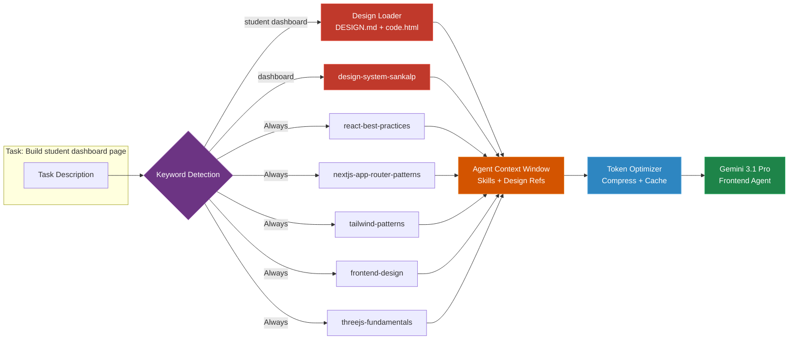
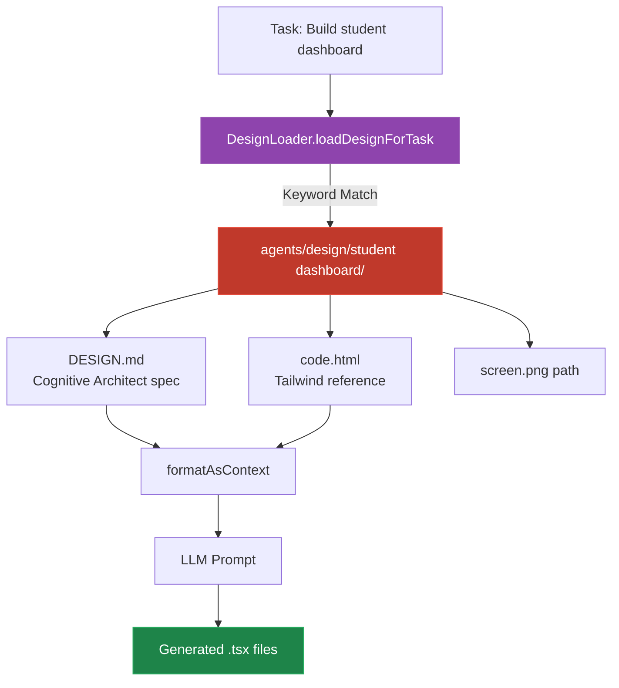
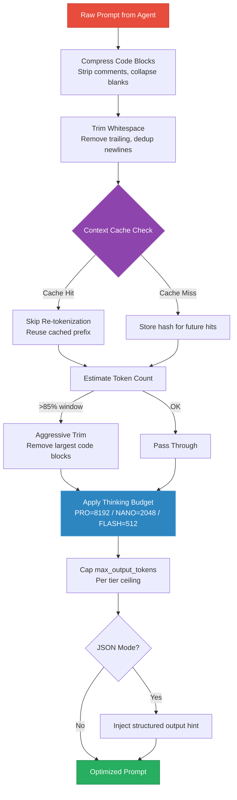

# Domain Agents

To ensure high-quality output, tasks are not given to a generic LLM. Instead, the Dispatcher hands tasks to one of six specialized **Domain Agents**. Each agent inherits from `BaseAgent` and receives **dynamically injected skills** from the 1,268-skill library at execution time. The Frontend Agent additionally receives **reference design assets** from the 22-screen design library.

## Architecture: Skill + Design Enhanced Inheritance

```mermaid
classDiagram
    class BaseAgent {
        +role: AgentRole
        +pool: PoolManager
        +promptBuilder: PromptBuilder
        +tokenOptimizer: TokenOptimizer
        +skillLoader: SkillLoader
        +execute(task)*
        #callLLM(prompt, system, options)
        #buildPrompt(desc, context) → systemPrompt + userPrompt + skillsLoaded
        #parseAndApplyFiles(response, taskId)
        #result(success, files, msg, tokens, attempts, skills)
    }

    class SkillLoader {
        +skillsRoot: string
        +fallbackSkillsRoot: string
        +loadSkillsForAgent(role, taskDesc, budget)
        +formatSkillsAsContext(skills)
        +getSkillManifest()
        -readSkillContent(skillId) Dual-path lookup
        -getKeywordActivatedSkills(task, pool)
    }

    class DesignLoader {
        +designRoot: string
        +loadDesignForTask(taskDesc, maxScreens)
        +loadScreen(screenDir)
        +formatAsContext(assets, includeHtml)
        +runDesignChecklist(code) 8 rules
        +formatChecklistResults(items)
        +listScreenDirs()
    }

    class TokenOptimizer {
        +optimize(sys, user, tier, opts)
        +getCacheStats()
        -compressCodeBlocks(text)
        -trimWhitespace(text)
        -aggressiveTrim(text, max)
        -checkContextCache(sys)
    }

    class FrontendAgent {
        +designLoader: DesignLoader
        +Core Skills: design-system-sankalp, react, nextjs, tailwind, threejs
        +Design Injection: DESIGN.md + code.html per screen
        +Tier: PRO 65K tokens
    }
    class BackendAgent {
        +Core Skills: typescript-expert, nodejs-backend, firebase, zod
        +Context: 12 Blocks, Firestore, RBAC
        +Tier: PRO 65K tokens
    }
    class IntegrationAgent {
        +Core Skills: architecture-patterns, api-patterns, DDD
        +Context: Pipeline Wiring, Type Boundaries
        +Tier: PRO 65K tokens
    }
    class TestingAgent {
        +Core Skills: testing-patterns, e2e-testing, js-testing
        +Context: Vitest, Pytest, Bayesian Edge Cases
        +Tier: NANO_PRO 32K tokens
    }
    class DevOpsAgent {
        +Core Skills: firebase, github-actions, deployment
        +Context: GCP, CI/CD, Config Only
        +Tier: FLASH 16K tokens
    }
    class TokenOptimizerAgent {
        +Core Skills: cost-optimization
        +Context: Token Budget, Cache, Compression
        +Tier: FLASH 16K tokens
    }

    BaseAgent <|-- FrontendAgent
    BaseAgent <|-- BackendAgent
    BaseAgent <|-- IntegrationAgent
    BaseAgent <|-- TestingAgent
    BaseAgent <|-- DevOpsAgent
    BaseAgent <|-- TokenOptimizerAgent
    BaseAgent o-- SkillLoader : "loads skills via"
    BaseAgent o-- TokenOptimizer : "optimizes every call via"
    FrontendAgent o-- DesignLoader : "injects design refs via"
```

## Skill Injection per Agent

Each agent receives skills in two tiers:
- **Core Skills** (always loaded): Domain fundamentals that every task needs.
- **Supplementary Skills** (keyword-activated): Loaded only when the task description matches activation keywords.

The Frontend Agent also receives a third context layer: **Design References** from `agents/design/`.

## Agent Skill Manifest

| Agent | Core Skills | Supplementary Skills (keyword-activated) |
|-------|-------------|------------------------------------------|
| **Frontend** | `design-system-sankalp`, `react-best-practices`, `nextjs-app-router-patterns`, `tailwind-patterns`, `frontend-design`, `threejs-fundamentals` | `react-state-management`, `threejs-materials`, `threejs-postprocessing`, `animejs-animation`, `scroll-experience`, `accessibility-*`, `i18n-*`, `web-performance-*`, `zustand-*`, `shadcn` |
| **Backend** | `typescript-expert`, `nodejs-backend-patterns`, `api-design-principles`, `firebase`, `zod-validation-expert` | `auth-implementation-*`, `error-handling-*`, `api-security-*`, `database-design`, `gemini-api-dev`, `bayesian-mastery-engine`, `backend-dev-*`, `cqrs-*` |
| **Integration** | `architecture-patterns`, `api-patterns`, `typescript-expert`, `domain-driven-design` | `event-sourcing-*`, `microservices-*`, `workflow-orchestration-*`, `data-structure-*`, `saga-*` |
| **Testing** | `testing-patterns`, `javascript-testing-patterns`, `e2e-testing-patterns` | `python-testing-*`, `tdd-workflows-*`, `playwright-skill`, `k6-load-testing`, `test-driven-*` |
| **DevOps** | `firebase`, `github-actions-templates`, `deployment-procedures` | `gcp-cloud-run`, `secrets-management`, `observability-*`, `prometheus-*`, `cost-optimization` |
| **Visual Validator** | `design-system-sankalp`, `code-review-checklist` | `vibe-code-auditor` |
| **Token Optimizer** | `cost-optimization` | `web-performance-optimization` |

## 1. Frontend Agent (`src/agents/frontend.ts`)
- **Focus**: UI/UX, Next.js App Router, Tailwind CSS, React Three Fiber.
- **Core Skills Loaded**: Design system spec (Cognitive Architect), React best practices, Next.js App Router patterns, Tailwind patterns, frontend design aesthetics, Three.js fundamentals.
- **Design Injection**: Automatically detects which screen(s) the task targets via `DesignLoader`. Injects:
  - The `DESIGN.md` specification (colors, typography, No-Line Rule, neumorphism, component patterns)
  - The reference `code.html` (truncated at 12KB per screen)
  - Prompt header: "⚠️ CRITICAL: Reference Design Assets — your implementation MUST faithfully replicate the visual language"
- **Context Injection**: Rules enforcing the Cognitive Architect aesthetic — neumorphic shadows, glassmorphism, micro-interactions, No-Line Rule (no 1px solid borders), and Bayesian UI components (`Beta(α,β)` CI probability rings).
- **Supplementary Activation**: Tasks mentioning "brain map" trigger Three.js material/postprocessing skills. Tasks mentioning "scroll" activate the scroll experience skill.

### Frontend Agent Design Flow

## 2. Backend Agent (`src/agents/backend.ts`)
- **Focus**: Express.js routes, Firestore infrastructure, core Intelligence engine processing.
- **Core Skills Loaded**: TypeScript expert patterns, Node.js backend architecture, API design principles, Firebase integration, Zod validation.
- **Context Injection**: Enforces the 12 Canonical Blocks (Observe → Model → Decide), `Zod` validation boundaries, `RBAC` (Role Based Access Control) middleware, and strict TypeScript.
- **Supplementary Activation**: Tasks mentioning "auth" trigger authentication skills. Tasks mentioning "database" activate data modeling skills.

## 3. Integration Agent (`src/agents/integration.ts`)
- **Focus**: Wiring different modular boundaries together securely.
- **Core Skills Loaded**: Architecture patterns, API design patterns, TypeScript cross-boundary safety, Domain-Driven Design.
- **Context Injection**: Specialized in cross-connecting the `Brain Map™` logic with `ADK` (Adaptive Decision Knowledge), injecting types into the `pipeline.ts` flow.
- **Supplementary Activation**: Tasks mentioning "event" trigger event sourcing skills. Tasks mentioning "workflow" activate orchestration skills.

## 4. Testing Agent (`src/agents/testing.ts`)
- **Focus**: Vitest (TS) and Pytest (Python) mock and test generation.
- **Core Skills Loaded**: Testing patterns (Jest/Vitest), JavaScript testing patterns, end-to-end testing architecture.
- **Context Injection**: Enforces mandatory edge cases including first-time students, handling of missing mastery bounds, and mathematical verification that `α + β` strictly increases in Bayesian tests.
- **Supplementary Activation**: Tasks involving Python activate pytest skills. Tasks mentioning "e2e" trigger Playwright skills.

## 5. DevOps Agent (`src/agents/devops.ts`)
- **Focus**: Configuration, CI/CD, and Hosting definitions.
- **Core Skills Loaded**: Firebase hosting/functions/rules, GitHub Actions CI/CD templates, deployment procedures.
- **Context Injection**: Focuses on `firebase.json`, `firestore.rules`, and GCP dashboards. Limits the agent's scope strictly to configuration data rather than core logic modification.
- **Supplementary Activation**: Tasks mentioning "deploy" activate full deployment procedure skills. Tasks mentioning "monitoring" trigger observability skills.

## 6. Token Optimizer Agent (`src/agents/token-optimizer-agent.ts`)
- **Focus**: Reducing token consumption, latency, and API costs without compromising output quality.
- **Core Skills Loaded**: Cost optimization strategies.
- **Context Injection**: Runs transparently inside every `BaseAgent.callLLM()` call. Compresses code blocks, deduplicates system prompts via context caching, applies per-tier thinking budgets, and enforces output token caps.
- **How It Works**: Unlike other agents, the Token Optimizer does not generate code. It operates as a middleware layer that intercepts and optimizes every LLM invocation system-wide.

### Token Optimization Techniques

| Technique | Applies To | Savings |
|-----------|-----------|---------|
| **Context Caching** | Repeated system prompts | Avoids re-tokenization on cache hit |
| **Code Block Compression** | TS/JS code in context | 10–25% fewer chars |
| **Thinking Budget** | All tiers | Flash tasks use minimal reasoning (512 tok) |
| **Output Capping** | All tiers | Prevents runaway output generation |
| **Aggressive Trim** | Oversize prompts (>85% window) | Emergency truncation of largest blocks |
| **Structured Output Hint** | JSON-mode calls | Eliminates wasted prose tokens |
| **Batch Eligibility** | Flash-tier deferrable tasks | 50% cost discount via Batch API |

