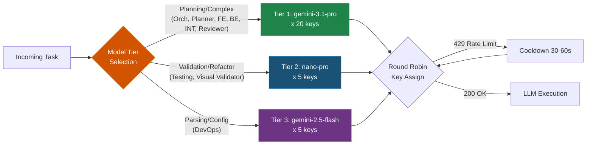
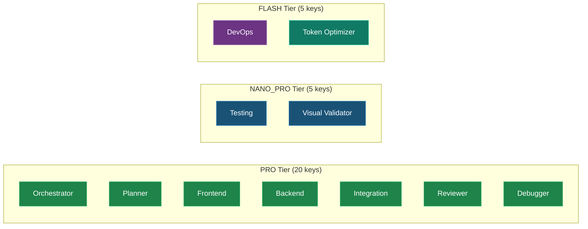
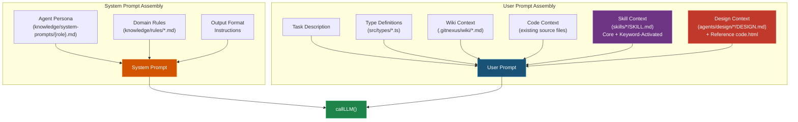
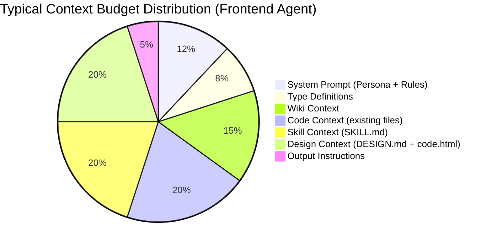

# LLM Pool & Context Engine

To bypass generic LLM limitations, the Agent System relies on custom resource pooling, dynamic context injection, **skill-enhanced prompt engineering**, and **design-system aware context assembly**.

## API Key Pool Manager (`src/llm/pool-manager.ts`)
SANKALP-AEI utilizes an aggressive **30-key Google Gemini architecture** loaded via `.env.agents`.
- **Top Tier (20 Keys):** `gemini-3.1-pro-preview`. Handled by the heavy lifters (Planning, Execution, Architectural Design).
- **Core Tier (5 Keys):** `nano-banana-pro-preview`. Handled by the structural validators, refactoring scripts, and localized fixes.
- **Fast Tier (5 Keys):** `gemini-2.5-flash`. Exclusively for rapid JSON parsing, log scanning, and single-file structural tests where speed trumps reasoning.

The manager automatically rotates keys round-robin, catching `429 Rate Limit` exceptions and throwing a local timeout (`30s` to `60s`) on individual keys while seamlessly failing over to valid keys.



## Agent → Model Tier Mapping



## The Context Engine

Instead of dumping the entire repository into a prompt, the system relies on structured semantic parsing combined with **dynamic skill injection** and **design reference loading**:

```mermaid
graph TD
    subgraph "Context Sources"
        W[Wiki Reader<br/>".gitnexus/wiki/*.md"] --> ContextPool
        F[File Scanner<br/>"src/**/*.ts"] --> ContextPool
        T[Task Parser<br/>"tasks.md deltas"] --> ContextPool
        SK[Skill Loader<br/>"skills/*/SKILL.md"] --> ContextPool
        DL[Design Loader<br/>"agents/design/*/DESIGN.md"] --> ContextPool
    end

    ContextPool[Context Pool<br/>Merged Raw Context] -->|Truncate / Prioritize| Budget[Token Budget<br/>Enforcer]
    Budget --> SysPrompt[System Prompt<br/>Persona + Rules + Skills]
    Budget --> UsrPrompt[User Prompt<br/>Task + Types + Code + Wiki + Design]

    SysPrompt & UsrPrompt --> AgentEnv[Domain Agent<br/>LLM Call]

    style SK fill:#6C3483,stroke:#A569BD,color:#fff
    style DL fill:#C0392B,stroke:#E74C3C,color:#fff
    style ContextPool fill:#D35400,stroke:#E67E22,color:#fff
    style AgentEnv fill:#1E8449,stroke:#27AE60,color:#fff
```

### Context Composition Pipeline



## Context Sources Detail

1. **Wiki Reader (`src/context/wiki-reader.ts`)**
   Reads all `.gitnexus/wiki/` `.md` mapping files. It detects topics (Frontend vs Backend) and selectively injects relevant architecture rules into the system prompt.

2. **File Scanner (`src/context/file-scanner.ts`)**
   Navigates the `.ts` and `.tsx` structures to detect imports, schema shapes, core boundaries, and available UI components to prevent the LLM from hallucinating file paths. Maintains a strict `byte` ceiling limit using chunking to prevent token overflow.

3. **Task Parser (`src/context/task-parser.ts`)**
   Reads `tasks.md` to generate intelligent deltas. Allows the AI planner to determine exactly what files still need implementation.

4. **Skill Loader (`src/skills/skill-loader.ts`)**
   Reads `SKILL.md` files from two locations — the primary `skills/` directory and the fallback `agents/knowledge/skills/` directory — based on the `SkillRegistry` mapping. Each agent role has pre-assigned core skills and supplementary skills that activate via keyword matching. The loader enforces an **80KB byte budget** to prevent context window overflow, prioritizing core skills over supplementary ones.

5. **Design Loader (`src/design/design-loader.ts`)** *(NEW)*
   Maps task keywords to screen-specific design assets from `agents/design/`. It:
   - Maintains a **40+ keyword → screen directory** mapping (`SCREEN_KEYWORD_MAP`)
   - Reads `DESIGN.md` (design spec), `code.html` (reference implementation), and `screen.png` path
   - Formats design assets as prompt-ready context blocks (HTML truncated at 12KB per screen)
   - Runs a **static design compliance checklist** (8 rules, zero LLM cost) for use in visual validation
   - Caches loaded assets in memory to avoid redundant disk reads

## Design Loader Keyword Map

The `DesignLoader` uses keyword matching to determine which reference design(s) to load:

| Keyword Group | Maps To Screen | Directory |
|---------------|---------------|-----------|
| "student dashboard", "student home", "dashboard" | Student Dashboard | `student dashboard/` |
| "teacher dashboard", "teacher home" | Teacher Dashboard | `teacher dashboard/` |
| "landing", "landing page", "home page" | Landing Page | `landing page/` |
| "login", "sign up", "register", "registration" | Registration | `registration/` |
| "ai companion", "ai tutor", "companion" | AI Companion | `aicompanion/` |
| "student analytics" | Student Analytics | `student analytics/` |
| "study session" | Study Session | `study session/` |
| "metacognition" | Metacognition | `metacognition/` |
| "lesson planning", "lesson plan" | Lesson Planning | `lesson planning/` |
| "cockpit", "admin" | Cockpit | `cockpit/` |
| "system health", "system monitor" | System Health | `systemhealth/` |
| "user management", "user admin" | User Management | `user management/` |
| "config", "configuration", "settings" | Config | `config/` |
| "help center", "help", "support" | Help Center | `help center/` |

## Skill Loading Budget Model


