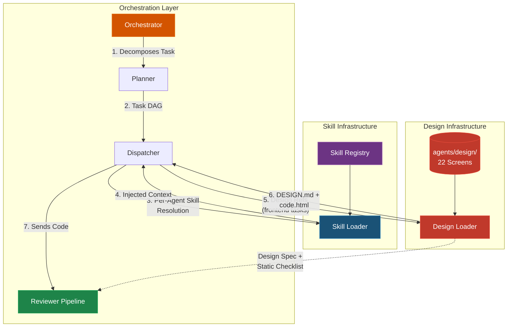
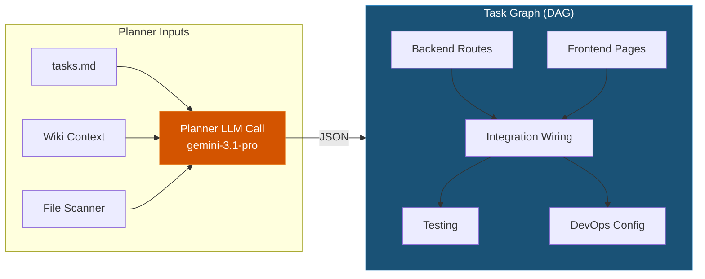
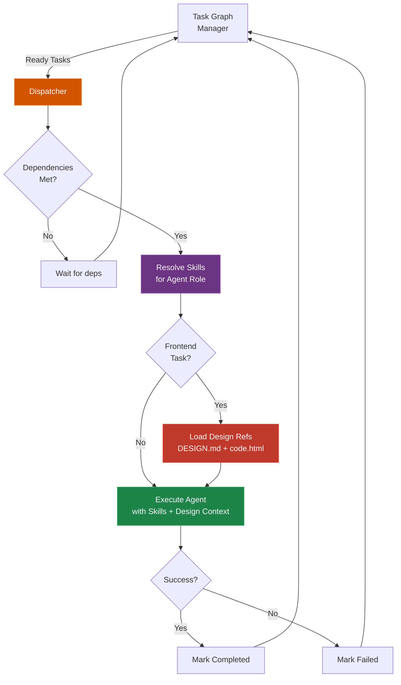
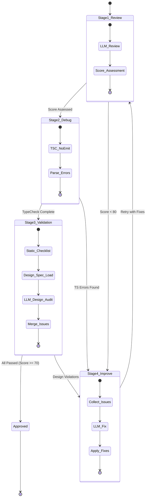
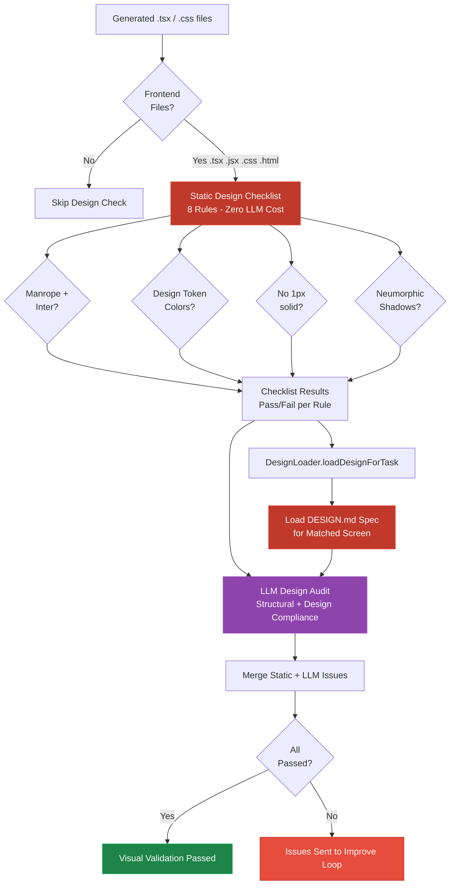
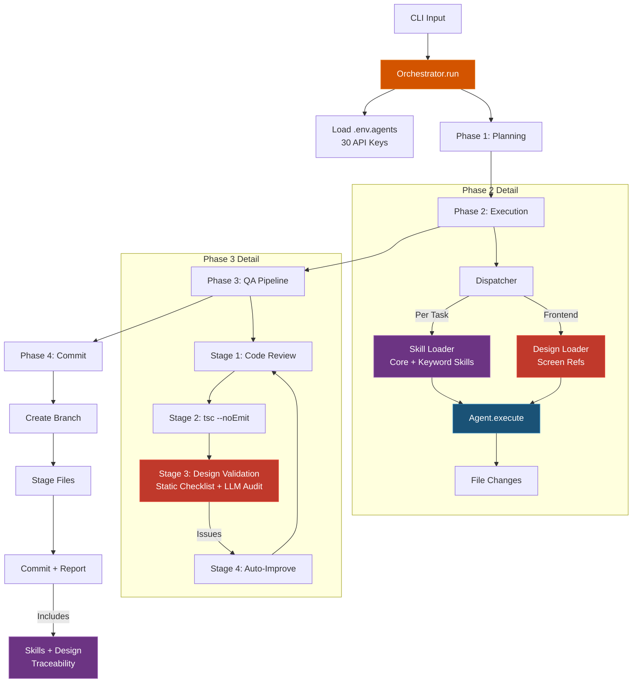

# Orchestration Engine

The Orchestration layer is the "central nervous system" of the SANKALP-AEI Agents infrastructure. It integrates **dynamic skill loading** and **design-system validation** at every stage to ensure each component operates with domain-expert knowledge and visual fidelity.

## 1. Orchestrator (`src/core/orchestrator.ts`)
The `Orchestrator` is the top-level class invoked by the CLI. It handles:
- **Initialization**: Loading API keys, mounting the Git/FS tools, and spinning up the Context Engine.
- **Workflow Pipeline**: Calling the Planner, Dispatching the tasks, running the Quality Gate, and pushing to Git.
- **Skills Traceability**: The final report now includes a `## Skills Injected` section listing which `SKILL.md` files were loaded into each agent's context window.
- **Design Traceability**: Frontend tasks log which design screen references were loaded (e.g., `🎨 Design refs loaded: Student Dashboard`).
- **Reporting**: Generating Markdown reports showing exactly how long the execution took, which tokens were used, and what files failed the QA gate.

## 2. Planner (`src/core/planner.ts`)
When given a highly ambiguous natural language task (e.g., "Build the missing routes"), the Planner:
- Reads `tasks.md` to spot missing project components.
- Scans `src/` to see the current codebase.
- Commands the heavy-tier LLM (`gemini-3.1-pro-preview`) to break the goal into atomic `subtasks`.
- Wires the subtasks together in a DAG (Directed Acyclic Graph) via the `TaskGraphManager`. (E.g., "Tests" must depend on "Backend").

## 3. Dispatcher (`src/core/dispatcher.ts`)
The `Dispatcher` queries the `TaskGraphManager` for actionable nodes. If a task has met all its dependencies, standard parallelization allows multiple agents to hit the codebase concurrently.
- Protects against concurrency collisions by running file modifications sequentially where API rate limits demand.
- **Skill Resolution**: Before dispatching to an agent, the system resolves which skills that agent will receive based on the task keywords.
- **Design Resolution**: For Frontend tasks, the `DesignLoader` automatically detects matching screens and prepares design context.

## 4. Reviewer Pipeline (`src/core/reviewer.ts`)
Before any code goes to a git commit, it passes through a **four-stage pipeline** — now enhanced with design-system compliance checking:

- **Stage 1 (Review):** LLM flags generic architectural or type errors.
- **Stage 2 (Debug):** The system literally runs `npx tsc --noEmit` and captures compiler errors.
- **Stage 3 (Visual Validation):** **Two-pass design-aware audit:**
  - **3a. Static Design Checklist** (zero LLM cost): 8 rules checked against generated code:
    1. Manrope font imported
    2. Inter font imported
    3. Primary color token (#702ae1) used
    4. No generic color values (bg-blue-*, bg-red-*)
    5. No hard 1px solid borders (No-Line Rule)
    6. Neumorphic shadow classes present
    7. Elements are rounded (border-radius >= 1rem)
    8. Primary CTA uses gradient fill
  - **3b. LLM Design Audit:** Passes static checklist results + DESIGN.md spec into an LLM prompt for deeper structural and design validation.
- **Stage 4 (Improve):** Automatically fixes problems flagged in previous stages (including design violations).

### Visual Validation Deep Dive

## Complete Orchestration Data Flow

