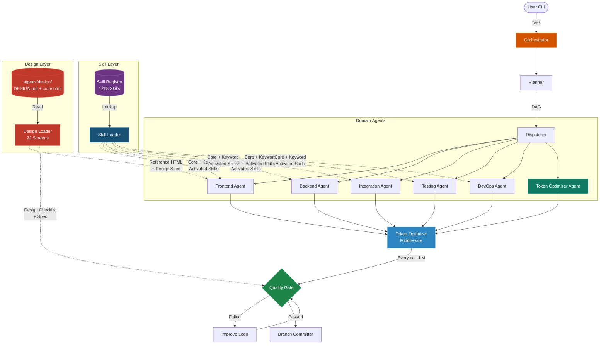
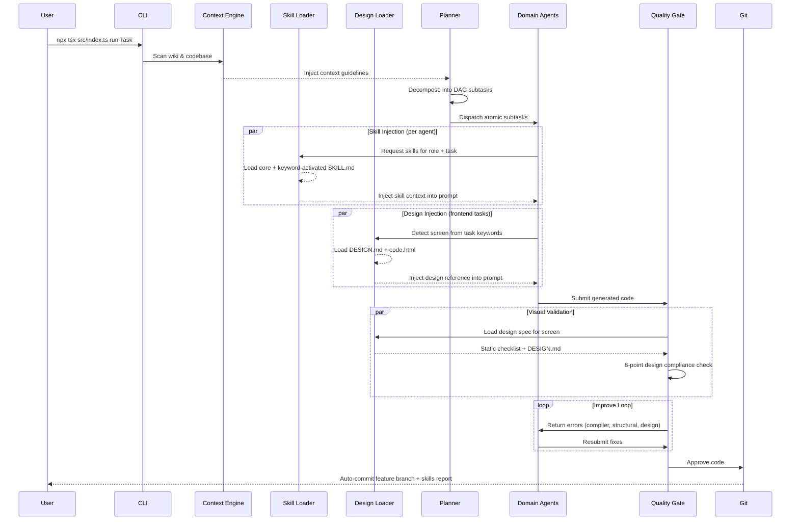
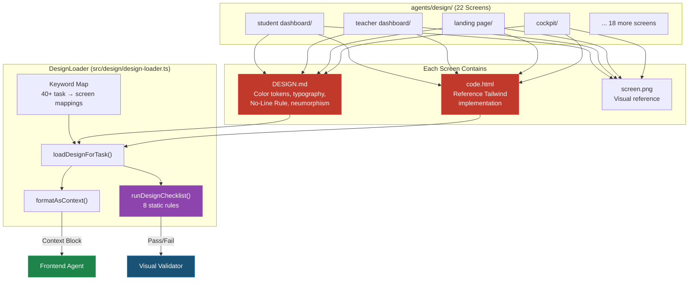
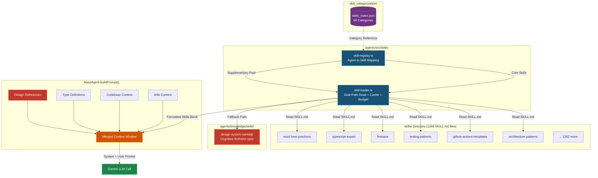

# System Overview

The **SANKALP-AEI Multi-Agent Orchestration System** is an autonomous development pipeline housed in the `agents/` directory. It uses a pool of 30 Gemini API keys to autonomously execute development tasks, acting as a hyper-capable AI developer perfectly attuned to the specific architectural laws (Bayesian Brain Map™, Node.js/Next.js) of the SANKALP project.

## Architecture

The system mimics a software development team with **dynamic skill injection** and **design-system awareness** — each agent loads curated expertise from the 1,268-skill library at execution time, and the Frontend Agent additionally receives reference designs from the 22-screen design library:

1. **The Brain (Orchestrator)** acts as the Tech Lead, taking a high-level task and deciding how to accomplish it.
2. **The Planner** decomposes large tasks into actionable Graph nodes (a Directed Acyclic Graph of subtasks).
3. **The Dispatcher** parallelizes work and assigns nodes to specialized domain agents.
4. **Domain Agents** (Frontend, Backend, Integration, Testing, DevOps) load relevant skills and generate code.
5. **The Design Layer** (`DesignLoader`) maps task keywords to reference designs (DESIGN.md + code.html + screen.png) from `agents/design/`, automatically injecting visual references into Frontend Agent and Visual Validator context windows.
6. **The Quality Gate** (Reviewer Pipeline) enforces architecture review, TypeScript compilation checks, **design-system compliance** (static checklist + LLM audit), and self-improvement loops.
7. **The Branch Committer** automatically stages and commits changes onto feature branches.

## Core Tenets
- **Skill-Aware Agents:** Each agent dynamically loads domain-specific expertise from the `skills/` library, grounding LLM outputs with proven patterns and best practices.
- **Design-Driven Frontend:** The Frontend Agent and Visual Validator receive pixel-accurate reference designs from `agents/design/` — 22 screens with DESIGN.md specs, Tailwind reference HTML, and screenshots.
- **Data Safety:** Uses `fs-tools.ts` to create localized backups in `agents/output/diffs/` before any file write.
- **API Resilience:** Uses exponential backoff and rate-limit tracking across 30 keys to guarantee robust API interactions.
- **SANKALP Specificity:** All agents are grounded in the `.gitnexus/wiki/` context and strict `Zod`/`Beta(α, β)` rules.

## The Execution Pipeline
When a user runs a task via the CLI (`npx tsx src/index.ts run "Build API"`):
1. **Plan:** The Context Engine reads the wiki and the codebase. The Planner decomposes the task into 5 to 10 subtasks.
2. **Skill Resolution:** For each assigned agent, the Skill Loader queries the Skill Registry and activates relevant `SKILL.md` files based on the agent role and task keywords.
3. **Design Resolution:** For frontend tasks, the Design Loader detects which screen(s) the task targets (via 40+ keyword mappings) and loads the reference `DESIGN.md` + `code.html` from `agents/design/`.
4. **Execute:** Domain Agents receive their loaded skill context + design references alongside wiki + codebase context and generate code.
5. **Design Validation:** The Visual Validator runs an 8-point static design checklist (fonts, colors, borders, shadows) at zero LLM cost, then passes results + DESIGN.md spec into an LLM audit.
6. **Review:** Output is evaluated. If it fails typing, architectural rules, or design compliance, an `<Improve>` loop runs.
7. **Commit:** Success leads to an automated git commit with a detailed statistics report including skills traceability.

## Design System Integration

The `agents/design/` directory contains **22 reference screen designs**, each with:
- `DESIGN.md` — The "Cognitive Architect" design system specification (colors, typography, spacing, components)
- `code.html` — A pixel-accurate Tailwind/HTML reference implementation
- `screen.png` — Visual reference screenshot

## Skill-Enhanced Agent Architecture

The dynamic skill injection system connects the 1,268-skill library (organized across 66 categories) to each agent's context window:

