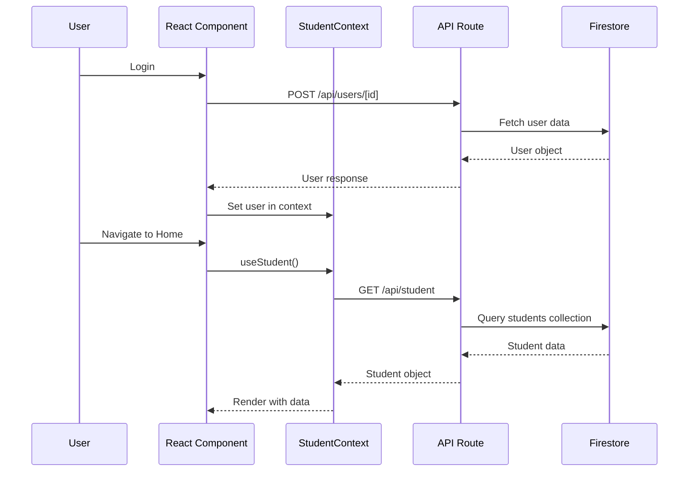
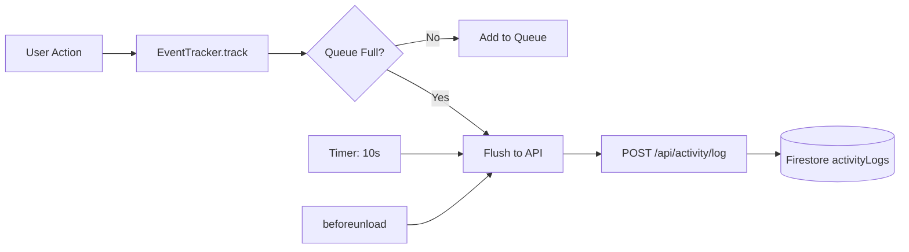
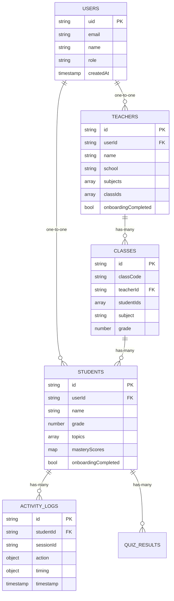
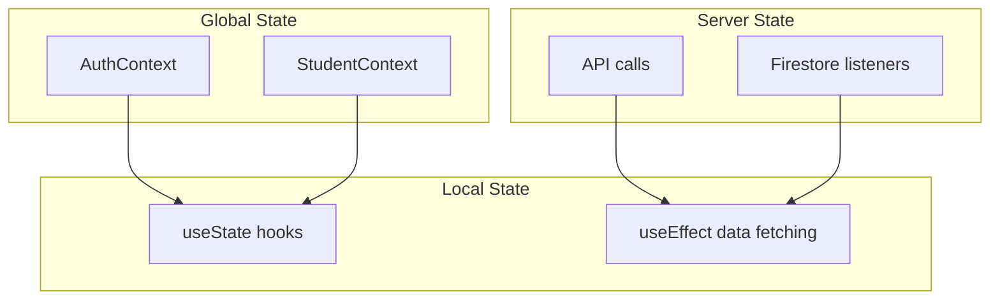
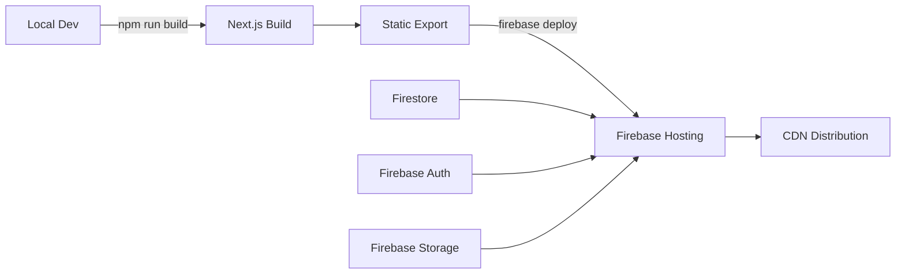

# 🏗️ Architecture Map

> Technical architecture, folder structure, and system design

---

## 📁 Project Structure

```
SANKALP/
├── 📱 src/
│   ├── 🎨 app/                    # Next.js App Router
│   │   ├── (auth)/               # Auth-related pages
│   │   │   ├── login/
│   │   │   ├── sign-up/
│   │   │   ├── onboarding/       # Student onboarding
│   │   │   └── teacher-onboarding/
│   │   ├── (main)/               # Main app pages
│   │   │   ├── home/             # Student dashboard
│   │   │   ├── brain-map/
│   │   │   ├── planner/
│   │   │   ├── quiz/
│   │   │   ├── chat/
│   │   │   ├── teacher/          # Teacher dashboard
│   │   │   └── layout.tsx        # Role-based sidebar
│   │   ├── api/                  # API Routes
│   │   │   ├── student/
│   │   │   ├── teacher/
│   │   │   ├── activity/
│   │   │   ├── users/
│   │   │   └── quiz/
│   │   ├── globals.css
│   │   └── layout.tsx            # Root layout
│   │
│   ├── 🧩 components/
│   │   ├── app/                  # App-wide components
│   │   │   ├── header.tsx
│   │   │   ├── sidebar-nav.tsx   # Student sidebar
│   │   │   └── teacher-sidebar-nav.tsx
│   │   ├── ui/                   # shadcn/ui components
│   │   │   ├── button.tsx
│   │   │   ├── card.tsx
│   │   │   └── ...
│   │   ├── InteractiveGraph.tsx  # Brain map
│   │   └── LogoutButton.tsx
│   │
│   ├── 🧠 contexts/
│   │   ├── AuthContext.tsx       # Firebase auth state
│   │   └── StudentContext.tsx    # Student data provider
│   │
│   ├── 🔧 lib/
│   │   ├── firebase.ts           # Client-side Firebase
│   │   ├── firebase-admin.ts     # Server-side Firebase
│   │   ├── db-helpers.ts         # Firestore queries
│   │   ├── eventTracker.ts       # Activity tracking
│   │   └── utils.ts
│   │
│   ├── 📊 data/
│   │   └── docsData.ts           # Type definitions
│   │
│   └── 🎯 types/
│       └── index.ts
│
├── 🗄️ scripts/
│   ├── seed-personal.ts          # Seed user data
│   ├── seed-database.ts          # Legacy seeding
│   └── cleanup-db.ts             # Database cleanup
│
├── 📚 docs/                      # Obsidian documentation
│   ├── README.md
│   ├── Features Overview.md
│   ├── Development Status.md
│   └── Architecture Map.md
│
├── 🔥 Firebase Config
│   ├── firestore.rules           # Security rules
│   ├── firestore.indexes.json
│   ├── firebase.json
│   └── .firebaserc
│
└── ⚙️ Config Files
    ├── next.config.ts
    ├── tsconfig.json
    ├── tailwind.config.ts
    ├── .env.local
    └── package.json
```

---

## 🔀 Data Flow Architecture

### Student Flow



### Activity Tracking Flow



---

## 🎯 Component Architecture

### Key Design Patterns

#### 1. Role-Based Rendering
```typescript
// layout.tsx
const { role } = useAuth();

<Sidebar>
  {role === 'teacher' ? <TeacherSidebarNav /> : <SidebarNav />}
</Sidebar>
```

#### 2. Context Providers
```typescript
// App hierarchy
<AuthProvider>
  <StudentProvider>
    <EventTrackerInit />
    <SidebarProvider>
      {children}
    </SidebarProvider>
  </StudentProvider>
</AuthProvider>
```

#### 3. API Route Pattern
```typescript
// Consistent API structure
export async function GET(req: NextRequest) {
  try {
    const { searchParams } = new URL(req.url);
    const id = searchParams.get('id');
    
    if (!id) return NextResponse.json({ error }, { status: 400 });
    
    const data = await fetchFromDB(id);
    return NextResponse.json({ success: true, data });
  } catch (error) {
    return NextResponse.json({ error }, { status: 500 });
  }
}
```

---

## 🗄️ Database Architecture

### Firestore Collections



### Security Model

**Firestore Rules**:
```javascript
// Users can only read their own data
match /students/{studentId} {
  allow read: if request.auth.uid == studentId;
  allow write: if request.auth.uid == studentId;
}

match /teachers/{teacherId} {
  allow read: if request.auth.uid == teacherId;
  allow write: if request.auth.uid == teacherId;
}
```

---

## 🔌 API Design

### RESTful Conventions

| Resource | GET | POST | PUT | DELETE |
|----------|-----|------|-----|--------|
| `/api/student` | Get student | - | - | - |
| `/api/student/onboard` | - | Create student | - | - |
| `/api/student/graph` | Get graph data | - | - | - |
| `/api/teacher` | Get teacher | - | - | - |
| `/api/teacher/students` | List students | - | - | - |
| `/api/activity/log` | - | Log event | - | - |

### Response Format
```typescript
// Success
{
  "success": true,
  "data": { ... },
  "timestamp": 1706713200000
}

// Error
{
  "success": false,
  "error": "Error message",
  "code": "ERROR_CODE"
}
```

---

## 🎨 Frontend Architecture

### State Management



**State Sources**:
1. **AuthContext**: User auth state (global)
2. **StudentContext**: Current student data (global)
3. **Local State**: Component-specific UI state
4. **Server State**: Data fetched from APIs

### Styling System

- **Framework**: Tailwind CSS
- **Components**: shadcn/ui
- **Themes**: Light + Dark mode
- **Fonts**: 
  - Headline: Inter
  - Body: System fonts

---

## 🚀 Deployment Architecture

### Production Flow



### Environment Variables

```bash
# .env.local (not committed)
NEXT_PUBLIC_FIREBASE_API_KEY=
NEXT_PUBLIC_FIREBASE_AUTH_DOMAIN=
NEXT_PUBLIC_FIREBASE_PROJECT_ID=
NEXT_PUBLIC_FIREBASE_STORAGE_BUCKET=
NEXT_PUBLIC_FIREBASE_MESSAGING_SENDER_ID=
NEXT_PUBLIC_FIREBASE_APP_ID=
NEXT_PUBLIC_FIREBASE_MEASUREMENT_ID=

# Server-only (Firebase Admin)
FIREBASE_ADMIN_PROJECT_ID=
FIREBASE_ADMIN_PRIVATE_KEY=
FIREBASE_ADMIN_CLIENT_EMAIL=
```

---

## 🔗 Technology Stack

### Core Technologies
- **Framework**: Next.js 14 (App Router)
- **Language**: TypeScript
- **Styling**: Tailwind CSS + shadcn/ui
- **Database**: Firebase Firestore
- **Auth**: Firebase Authentication
- **Storage**: Firebase Storage
- **Hosting**: Firebase Hosting

### Key Libraries
- `react` - UI library
- `next` - React framework
- `firebase` - Backend services
- `lucide-react` - Icons
- `force-graph` - Brain map visualization
- `idb` - IndexedDB wrapper (event tracking)

### Development Tools
- TypeScript - Type safety
- ESLint - Code linting
- Prettier - Code formatting
- Git - Version control

---

## 📊 Performance Considerations

### Optimization Strategies

1. **Code Splitting**
   - Dynamic imports for heavy components
   - Route-based splitting (Next.js automatic)

2. **Data Fetching**
   - Server-side rendering for initial load
   - Client-side caching with React Query (planned)

3. **Bundle Size**
   - Tree shaking
   - Lazy loading components
   - Image optimization (next/image)

4. **Database**
   - Indexed queries
   - Pagination for large lists
   - Denormalization where needed

---

## 🔗 Related Docs

- [[Features Overview]]
- [[API Documentation]]
- [[Database Schema]]
- [[Deployment Guide]]

---

*Architecture updated: 2026-01-31*
