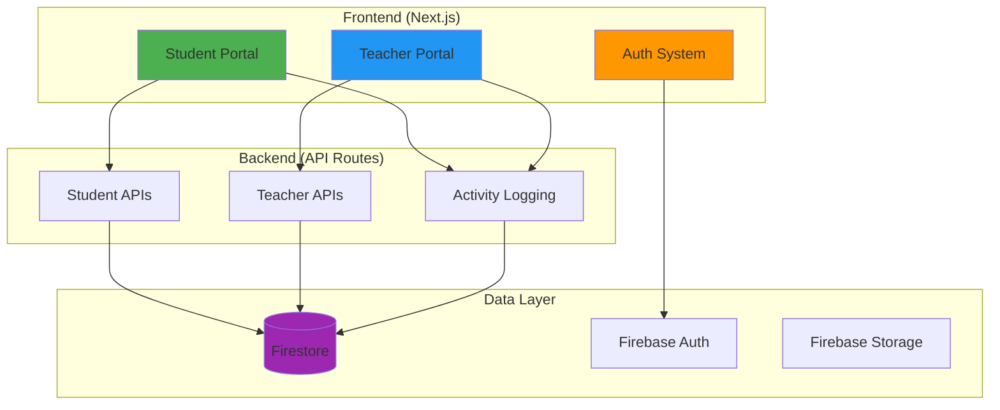

# 🧠 SANKALP Project Documentation

> **Last Updated**: 2026-01-31  
> **Status**: Active Development  
> **Version**: 1.0 Pre-Rollout

## 📋 Quick Navigation

- [[Features Overview]] - Complete feature breakdown
- [[Architecture Map]] - Technical architecture and structure
- [[Development Status]] - What's done, in-progress, and planned
- [[API Documentation]] - All API endpoints and usage
- [[Database Schema]] - Firestore collections and structure
- [[Deployment Guide]] - How to deploy and configure

---

## 🎯 Project Mission

SANKALP is an AI-powered personalized learning platform that helps students:
- **Track** their learning progress with visual brain maps
- **Plan** their study schedules with intelligent recommendations
- **Practice** with adaptive quizzes
- **Connect** with AI mentors for guidance
- **Analyze** their performance with detailed analytics

---

## 🏗️ High-Level Architecture



---

## 📊 Development Status Overview

### ✅ Completed (90%)
- Student onboarding flow
- Teacher onboarding flow
- Authentication system
- Brain Map visualization
- Firestore integration
- Separate student/teacher sidebars
- Production reliability fixes

### 🚧 In Progress (50%)
- Quiz generation system
- AI mentor integration
- Analytics dashboard

### 📝 Planned (0%)
- Teacher class management
- Parent portal
- Mobile app
- Gamification system

---

## 🔗 Related Documentation

- [[Technical Stack]]
- [[Known Issues]]
- [[Future Roadmap]]
- [[Contributing Guide]]

---

## 🚀 Quick Start

1. **Clone Repository**
   ```bash
   git clone <repository-url>
   cd SANKALP
   ```

2. **Install Dependencies**
   ```bash
   npm install
   ```

3. **Configure Environment**
   - Copy `.env.example` to `.env.local`
   - Add Firebase credentials

4. **Run Development Server**
   ```bash
   npm run dev
   ```

5. **Seed Database** (Optional)
   ```bash
   npx ts-node scripts/seed-personal.ts <USER_ID>
   ```

---

## 📞 Support

- **Documentation Issues**: Create an issue in the repository
- **Feature Requests**: Use the project board
- **Bugs**: Report via GitHub issues

---

*This documentation is maintained using Obsidian graph view. Use [[Links]] to navigate between documents.*
