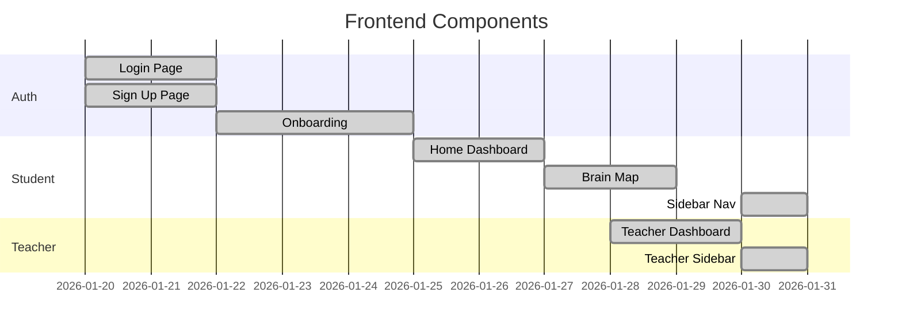

# 📈 Development Status

> Current state of the SANKALP project with actionable next steps

---

## 🎯 Sprint Overview

### Current Sprint: Production Readiness
**Duration**: Jan 20 - Feb 3, 2026  
**Focus**: Bug fixes, reliability, core features

#### Sprint Goals
- [x] Fix production API errors
- [x] Separate teacher/student interfaces
- [x] Improve error handling
- [ ] Complete quiz system
- [ ] Deploy to staging

---

## 📊 Progress by Category

### 1. Frontend Development

#### ✅ Fully Implemented (95%)


**Components**:
- ✅ Authentication pages (login, signup)
- ✅ Onboarding wizards (student & teacher)
- ✅ Student home dashboard
- ✅ Teacher risk dashboard
- ✅ Brain map visualization
- ✅ Sidebar navigation (role-based)
- ✅ Header component
- ✅ Theme toggle (dark/light mode)

**What's Missing**:
- 🚧 Quiz question generator UI
- 🚧 Planner calendar interactions
- 📝 Rewards visualization
- 📝 Analytics charts/graphs

---

### 2. Backend APIs

#### ✅ Core APIs (80%)

| Endpoint | Method | Status | Purpose |
|----------|--------|--------|---------|
| `/api/student` | GET | ✅ | Fetch student data |
| `/api/student/onboard` | POST | ✅ | Save onboarding |
| `/api/student/graph` | GET | ✅ | Get brain map data |
| `/api/teacher` | GET | ✅ | Fetch teacher data |
| `/api/teacher/onboard` | POST | ✅ | Save onboarding |
| `/api/teacher/students` | GET | ✅ | Get student list |
| `/api/teacher/graph` | GET | ✅ | Get class network |
| `/api/activity/log` | POST | ✅ | Log user activity |
| `/api/users/[userId]` | GET | ✅ | Get user by ID |
| `/api/users/create` | POST | ✅ | Create new user |
| `/api/quiz/submit` | POST | 🚧 | Submit quiz (partial) |
| `/api/planner/data` | GET/POST | 🚧 | Planner CRUD |
| `/api/classes/create` | POST | 📝 | Create class |
| `/api/classes/join` | POST | 📝 | Join class |

#### 🚧 Partial Implementation (40%)
- Quiz submission (needs question generation)
- Planner APIs (needs task persistence)

#### 📝 Not Started
- Rewards calculation API
- Analytics aggregation API
- Parent portal APIs

---

### 3. Database (Firestore)

#### ✅ Collections Defined (70%)

```
firestore/
├── users (✅)
│   ├── uid (string)
│   ├── email (string)
│   ├── name (string)
│   ├── role (student|teacher)
│   └── createdAt (timestamp)
│
├── students (✅)
│   ├── id (uid)
│   ├── name, grade, subjects
│   ├── onboardingCompleted (bool)
│   ├── topics (array)
│   └── masteryScores (map)
│
├── teachers (✅)
│   ├── id (uid)
│   ├── name, school, subjects
│   ├── onboardingCompleted (bool)
│   └── classIds (array)
│
├── activityLogs (✅)
│   ├── studentId, sessionId
│   ├── action (object)
│   ├── timing, data, metadata
│   └── timestamp
│
├── sankalpSessions (✅)
│   ├── studentId, startTime
│   ├── activitiesCompleted
│   └── timeBreakdown
│
├── classes (🚧)
│   ├── classCode, className
│   ├── teacherId, studentIds
│   └── subject, grade
│
└── quizResults (📝)
    └── Not yet implemented
```

**Seeding Status**:
- ✅ `scripts/seed-personal.ts` - Working
- ✅ Security rules - Deployed
- ⚠️ Indexes - Need optimization

---

### 4. Infrastructure & DevOps

#### ✅ Deployed Services
- Firebase Hosting (production)
- Firestore Database
- Firebase Authentication
- Firebase Storage (configured)

#### 🚧 In Progress
- Error logging (improved)
- Performance monitoring (basic)

#### 📝 Planned
- Automated testing (Jest + Cypress)
- CI/CD pipeline (GitHub Actions)
- Staging environment
- Backup strategy

---

## 🐛 Known Issues

### 🔴 Critical (P0)
None currently

### 🟠 High Priority (P1)
1. ~~Activity log 400 errors~~ ✅ Fixed (Jan 31)
2. ~~Teacher seeing student sidebar~~ ✅ Fixed (Jan 31)

### 🟡 Medium Priority (P2)
1. Planner not saving tasks
2. Quiz questions not generating
3. Auth lint errors in `AuthContext.tsx`

### 🔵 Low Priority (P3)
1. Missing TypeScript types in some files
2. Console warnings in development

---

## 🎯 Next Steps (Priority Order)

### Week 1 (Feb 3-9)
1. **Complete Quiz System** (2-3 days)
   - [ ] Create question bank structure
   - [ ] Implement question randomization
   - [ ] Add difficulty adaptation
   - [ ] Test and validate

2. **Fix Planner Persistence** (1-2 days)
   - [ ] Update Firestore schema
   - [ ] Implement save/load logic
   - [ ] Add optimistic UI updates

3. **Deploy to Staging** (1 day)
   - [ ] Set up staging Firebase project
   - [ ] Configure environment
   - [ ] Test deployment

### Week 2 (Feb 10-16)
1. **Teacher Class Management** (3-4 days)
   - [ ] Class creation UI
   - [ ] Class code generation
   - [ ] Student enrollment
   - [ ] Class dashboard

2. **Analytics Dashboard** (2-3 days)
   - [ ] Chart library integration
   - [ ] Data aggregation queries
   - [ ] Export functionality

### Week 3 (Feb 17-23)
1. **AI Mentor Integration** (4-5 days)
   - [ ] OpenAI API setup
   - [ ] Context management
   - [ ] Response streaming
   - [ ] Cost optimization

2. **Testing & QA** (2-3 days)
   - [ ] Write unit tests
   - [ ] E2E testing
   - [ ] Performance testing

---

## 📦 Parallel Tasks

These can be done simultaneously by different developers:

### Track A: Frontend
- Quiz UI improvements
- Analytics charts
- Rewards page design

### Track B: Backend
- Question generation API
- Class management API
- Performance optimization

### Track C: Infrastructure
- Testing setup
- CI/CD pipeline
- Documentation

---

## 🎨 Design System Status

### ✅ Implemented
- Color palette (primary, secondary, muted)
- Typography system
- shadcn/ui components
- Dark mode support
- Responsive layouts

### 📝 Missing
- Design tokens documentation
- Component storybook
- Accessibility guidelines
- Brand assets (logo variants)

---

## 📊 Metrics

### Code Quality
- **TypeScript Coverage**: 85%
- **Lint Errors**: 3 (down from 15)
- **Build Time**: ~45s
- **Bundle Size**: TBD

### Feature Completion
- **Student Features**: 44% complete (4/9)
- **Teacher Features**: 43% complete (3/7)
- **Infrastructure**: 56% complete (5/9)
- **Overall**: ~48% complete

---

## 🔗 Related Docs

- [[Features Overview]] - Detailed feature breakdown
- [[Known Issues]] - Bug tracker
- [[Future Roadmap]] - Long-term vision

---

*Last synced with codebase: 2026-01-31*
