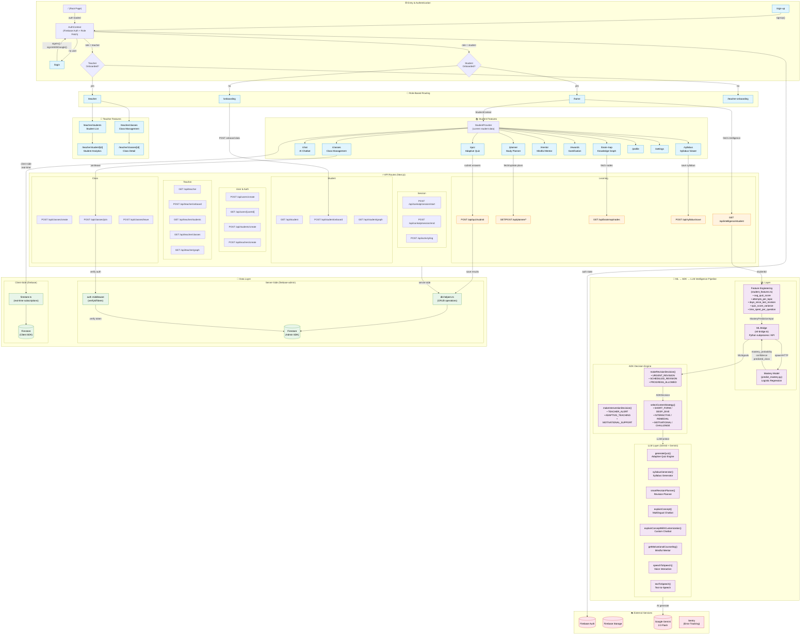

```mermaid
flowchart TB
    %% ========== ENTRY & AUTH LAYER ==========
    subgraph Entry["🌐 Entry & Authentication"]
        ROOT["/ (Root Page)"]
        LOGIN["/login"]
        SIGNUP["/sign-up"]
        
        LOGIN -->|"signIn() / signInWithGoogle()"| AUTH_CTX
        SIGNUP -->|"signUp()"| AUTH_CTX
        
        AUTH_CTX["AuthContext\n(Firebase Auth + Role Fetch)"]
        AUTH_CTX -->|"role = student"| STUDENT_ROUTING
        AUTH_CTX -->|"role = teacher"| TEACHER_ROUTING
        AUTH_CTX -->|"no user"| LOGIN
    end

    %% ========== ROUTING ==========
    subgraph Routing["🔀 Role-Based Routing"]
        ROOT -->|"auth loaded"| AUTH_CTX
        
        STUDENT_ROUTING{"Student\nOnboarded?"}
        STUDENT_ROUTING -->|"yes"| HOME["/home"]
        STUDENT_ROUTING -->|"no"| ONBOARD["/onboarding"]
        
        TEACHER_ROUTING{"Teacher\nOnboarded?"}
        TEACHER_ROUTING -->|"yes"| TEACHER_DASH["/teacher"]
        TEACHER_ROUTING -->|"no"| TEACHER_ONBOARD["/teacher-onboarding"]
    end

    %% ========== STUDENT PAGES ==========
    subgraph StudentPages["📚 Student Features"]
        HOME -->|"StudentContext"| STUDENT_CTX["StudentProvider\n(current student data)"]
        
        STUDENT_CTX --> QUIZ["/quiz\nAdaptive Quiz"]
        STUDENT_CTX --> CHAT["/chat\nAI Chatbot"]
        STUDENT_CTX --> PLANNER["/planner\nStudy Planner"]
        STUDENT_CTX --> BRAINMAP["/brain-map\nKnowledge Graph"]
        STUDENT_CTX --> SYLLABUS["/syllabus\nSyllabus Viewer"]
        STUDENT_CTX --> MENTOR["/mentor\nMindful Mentor"]
        STUDENT_CTX --> REWARDS["/rewards\nGamification"]
        STUDENT_CTX --> CLASSES["/classes\nClass Management"]
        STUDENT_CTX --> PROFILE["/profile"]
        STUDENT_CTX --> SETTINGS["/settings"]
    end

    %% ========== TEACHER PAGES ==========
    subgraph TeacherPages["🏫 Teacher Features"]
        TEACHER_DASH --> T_STUDENTS["/teacher/students\nStudent List"]
        TEACHER_DASH --> T_CLASSES["/teacher/classes\nClass Management"]
        T_STUDENTS --> T_STUDENT_DETAIL["/teacher/student/[id]\nStudent Analytics"]
        T_CLASSES --> T_CLASS_DETAIL["/teacher/classes/[id]\nClass Detail"]
    end

    %% ========== CLIENT → API LAYER ==========
    subgraph API["⚡ API Routes (Next.js)"]
        direction LR
        
        subgraph UserAPIs["User & Auth"]
            API_USER_CREATE["POST /api/users/create"]
            API_USER_GET["GET /api/users/[userId]"]
            API_STUDENT_CREATE["POST /api/students/create"]
            API_TEACHER_CREATE["POST /api/teachers/create"]
        end
        
        subgraph StudentAPIs["Student"]
            API_STUDENT["GET /api/student"]
            API_STUDENT_ONBOARD["POST /api/student/onboard"]
            API_STUDENT_GRAPH["GET /api/student/graph"]
        end
        
        subgraph TeacherAPIs["Teacher"]
            API_TEACHER["GET /api/teacher"]
            API_TEACHER_ONBOARD["POST /api/teacher/onboard"]
            API_TEACHER_STUDENTS["GET /api/teacher/students"]
            API_TEACHER_CLASSES["GET /api/teacher/classes"]
            API_TEACHER_GRAPH["GET /api/teacher/graph"]
        end
        
        subgraph ClassAPIs["Class"]
            API_CLASS_CREATE["POST /api/classes/create"]
            API_CLASS_JOIN["POST /api/classes/join"]
            API_CLASS_LEAVE["POST /api/classes/leave"]
        end
        
        subgraph LearningAPIs["Learning"]
            API_QUIZ_SUBMIT["POST /api/quiz/submit"]
            API_PLANNER["GET/POST /api/planner/*"]
            API_BRAINMAP["GET /api/brainmap/nodes"]
            API_SYLLABUS["POST /api/syllabus/save"]
            API_INTELLIGENCE["GET /api/intelligence/student"]
        end
        
        subgraph SessionAPIs["Session"]
            API_SESSION_START["POST /api/sankalp/session/start"]
            API_SESSION_END["POST /api/sankalp/session/end"]
            API_ACTIVITY["POST /api/activity/log"]
        end
    end

    %% ========== CLIENT → API CONNECTIONS ==========
    QUIZ -->|"submit answers"| API_QUIZ_SUBMIT
    PLANNER -->|"fetch/update plans"| API_PLANNER
    BRAINMAP -->|"fetch nodes"| API_BRAINMAP
    SYLLABUS -->|"save syllabus"| API_SYLLABUS
    CLASSES -->|"join/leave"| API_CLASS_JOIN
    HOME -->|"fetch intelligence"| API_INTELLIGENCE
    ONBOARD -->|"POST onboard data"| API_STUDENT_ONBOARD

    %% ========== AI INTELLIGENCE PIPELINE ==========
    subgraph Intelligence["🧠 ML → ADK → LLM Intelligence Pipeline"]
        direction TB
        
        subgraph ML["ML Layer"]
            FEATURES["Feature Engineering\n(student_features.ts)\n• avg_quiz_score\n• attempts_per_topic\n• days_since_last_revision\n• quiz_score_variance\n• time_spent_per_question"]
            ML_BRIDGE["ML Bridge\n(ml-bridge.ts)\nPython subprocess / API"]
            ML_MODEL["Mastery Model\n(predict_mastery.py)\nLogistic Regression"]
            
            FEATURES -->|"MasteryPredictionInput"| ML_BRIDGE
            ML_BRIDGE -->|"spawn/HTTP"| ML_MODEL
            ML_MODEL -->|"mastery_probability\nconfidence\npredicted_class"| ML_BRIDGE
        end
        
        subgraph ADK["ADK Decision Engine"]
            DECISION["makeRevisionDecision()\n• URGENT_REVISION\n• SCHEDULED_REVISION\n• PROGRESS_ALLOWED"]
            INTERVENTION["makeInterventionDecision()\n• TEACHER_ALERT\n• ADAPTIVE_TEACHING\n• MOTIVATIONAL_SUPPORT"]
            CONTENT_STRATEGY["selectContentStrategy()\n• SHORT_FORM / DEEP_DIVE\n• INTERACTIVE / REMEDIAL\n• MOTIVATIONAL / CHALLENGE"]
        end
        
        subgraph LLM["LLM Layer (Genkit + Gemini)"]
            QUIZ_GEN["generateQuiz()\nAdaptive Quiz Engine"]
            SYLLABUS_GEN["syllabusGenerator()\nSyllabus Generator"]
            REVISION_GEN["smartRevisionPlanner()\nRevision Planner"]
            CHATBOT["explainConcept()\nMultilingual Chatbot"]
            CUSTOM_CHAT["explainConceptWithCustomization()\nCustom Chatbot"]
            MENTOR_AI["getMotivationalCounseling()\nMindful Mentor"]
            SPEECH["speechToSpeech()\nVoice Interaction"]
            TTS["textToSpeech()\nText-to-Speech"]
        end
        
        ML_BRIDGE -->|"MLSignals"| DECISION
        DECISION -->|"ADKDecision"| CONTENT_STRATEGY
        CONTENT_STRATEGY -->|"LLMContext"| LLM
    end

    API_INTELLIGENCE -->|"studentId"| FEATURES
    API_QUIZ_SUBMIT -->|"save results"| DB_HELPERS

    %% ========== DATA LAYER ==========
    subgraph Data["💾 Data Layer"]
        subgraph ServerDB["Server-Side (firebase-admin)"]
            DB_HELPERS["db-helpers.ts\n(CRUD operations)"]
            AUTH_MW["auth middleware\n(verifyIdToken)"]
            ADMIN_DB[("Firestore\n(Admin SDK)")]
        end
        
        subgraph ClientDB["Client-Side (firebase)"]
            FIRESTORE_LIB["firestore.ts\n(real-time subscriptions)"]
            CLIENT_DB[("Firestore\n(Client SDK)")]
        end
        
        DB_HELPERS --> ADMIN_DB
        FIRESTORE_LIB --> CLIENT_DB
        AUTH_MW -->|"verify token"| ADMIN_DB
    end

    API -->|"server-side"| DB_HELPERS
    API_CLASS_JOIN -->|"verify auth"| AUTH_MW
    STUDENT_CTX -->|"client-side\nreal-time"| FIRESTORE_LIB

    %% ========== EXTERNAL SERVICES ==========
    subgraph External["☁️ External Services"]
        FIREBASE_AUTH[("Firebase Auth")]
        FIREBASE_STORAGE[("Firebase Storage")]
        GEMINI[("Google Gemini\n2.0 Flash")]
        SENTRY["Sentry\n(Error Tracking)"]
    end

    AUTH_CTX -->|"auth state"| FIREBASE_AUTH
    LLM -->|"AI generate"| GEMINI
    
    %% ========== STYLING ==========
    classDef page fill:#e1f5fe,stroke:#0288d1,color:#000
    classDef api fill:#fff3e0,stroke:#f57c00,color:#000
    classDef ai fill:#f3e5f5,stroke:#7b1fa2,color:#000
    classDef data fill:#e8f5e9,stroke:#388e3c,color:#000
    classDef ext fill:#fce4ec,stroke:#c62828,color:#000
    
    class HOME,QUIZ,CHAT,PLANNER,BRAINMAP,SYLLABUS,MENTOR,REWARDS,CLASSES,PROFILE,SETTINGS page
    class TEACHER_DASH,T_STUDENTS,T_CLASSES,T_STUDENT_DETAIL,T_CLASS_DETAIL page
    class LOGIN,SIGNUP,ONBOARD,TEACHER_ONBOARD page
    class API_INTELLIGENCE,API_QUIZ_SUBMIT,API_PLANNER,API_BRAINMAP,API_SYLLABUS api
    class FEATURES,ML_BRIDGE,ML_MODEL,DECISION,INTERVENTION,CONTENT_STRATEGY ai
    class QUIZ_GEN,SYLLABUS_GEN,REVISION_GEN,CHATBOT,CUSTOM_CHAT,MENTOR_AI,SPEECH,TTS ai
    class DB_HELPERS,AUTH_MW,ADMIN_DB,FIRESTORE_LIB,CLIENT_DB data
    class FIREBASE_AUTH,FIREBASE_STORAGE,GEMINI,SENTRY ext
```
