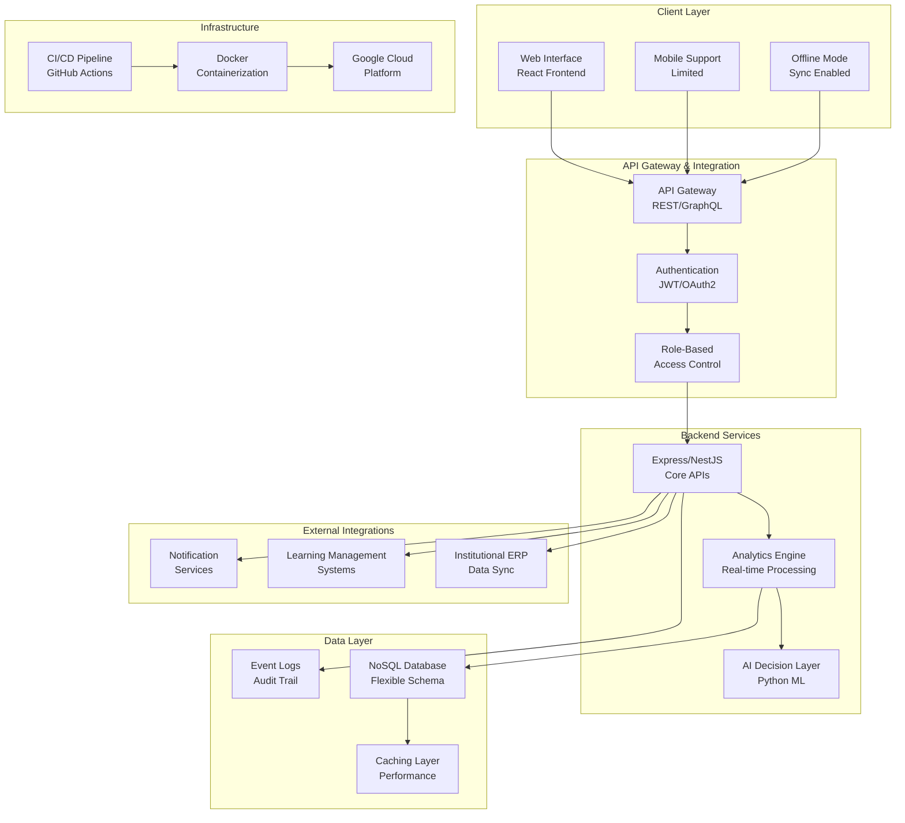
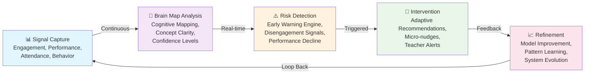
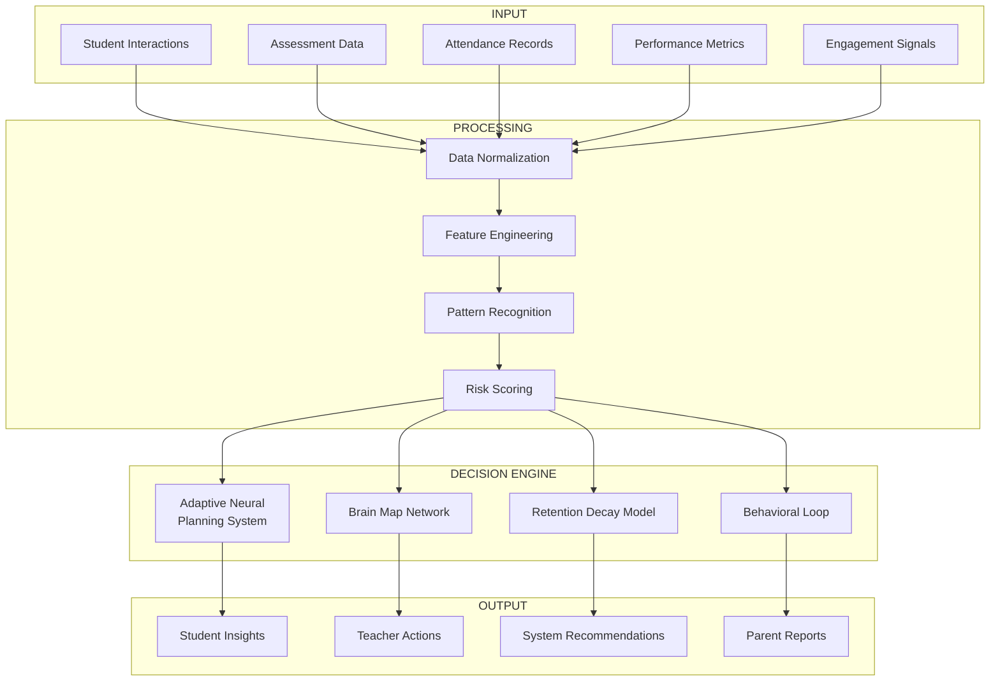
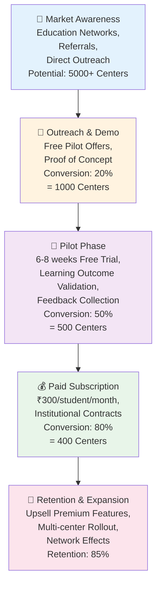
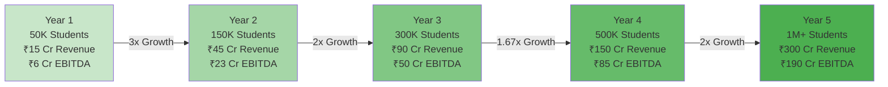
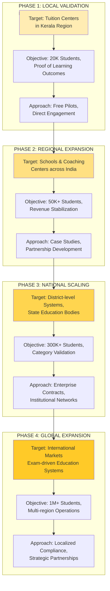
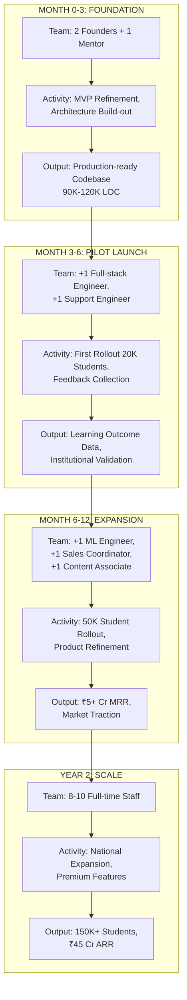
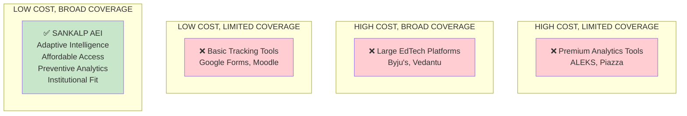
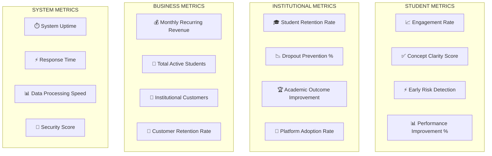

# SANKALP AEI - VISUAL MODELS, MARKETING PROMPTS & BUSINESS MODEL CANVAS

---

## SECTION 1: PRODUCT ARCHITECTURE DIAGRAMS

### 1.1 System Architecture Overview



### 1.2 Learning Intelligence Closed-Loop System



### 1.3 Product Feature Hierarchy

```mermaid
graph TD
    CORE["🎓 SANKALP AEI<br/>Core Platform"]
    
    CORE --> STUDENTS["👨‍🎓 Student Experience<br/>Layer"]
    CORE --> TEACHERS["👨‍🏫 Teacher Intelligence<br/>Layer"]
    CORE --> ADMIN["⚙️ Administration<br/>Layer"]
    CORE --> PARENTS["👨‍👩‍👧‍👦 Parent Visibility<br/>Layer"]
    
    STUDENTS --> S1["Adaptive Check-ins"]
    STUDENTS --> S2["Concept Clarity Tests"]
    STUDENTS --> S3["Personalized Guidance"]
    STUDENTS --> S4["Progress Tracking"]
    
    TEACHERS --> T1["Student Risk Dashboard"]
    TEACHERS --> T2["Concept-wise Analytics"]
    TEACHERS --> T3["Intervention Alerts"]
    TEACHERS --> T4["Performance Insights"]
    
    ADMIN --> A1["Institutional Dashboard"]
    ADMIN --> A2["Bulk User Management"]
    ADMIN --> A3["System Configuration"]
    ADMIN --> A4["Compliance Reporting"]
    
    PARENTS --> P1["Learning Progress Reports"]
    PARENTS --> P2["Engagement Metrics"]
    PARENTS --> P3["Academic Alerts"]
    PARENTS --> P4["Concept Breakdown"]
    
    style CORE fill:#ff6b6b
    style STUDENTS fill:#4ecdc4
    style TEACHERS fill:#45b7d1
    style ADMIN fill:#96ceb4
    style PARENTS fill:#ffeaa7
```



### 1.4 Data Flow & Decision Engine



---

## SECTION 2: BUSINESS & OPERATIONAL DIAGRAMS

### 2.1 Customer Acquisition Funnel



### 2.2 Revenue Growth Projection & Model



### 2.3 Market Expansion Strategy



### 2.4 Organizational Growth Timeline



### 2.5 Competitive Positioning Map



---

## SECTION 3: BUSINESS MODEL CANVAS

### BMC: SANKALP AEI Learning Intelligence Platform

```
╔════════════════════════════════════════════════════════════════════════════════════════╗
║                         BUSINESS MODEL CANVAS - SANKALP AEI                          ║
╠════════════════════════════════════════════════════════════════════════════════════════╣
║                                                                                        ║
║  KEY PARTNERS              │     KEY ACTIVITIES        │    VALUE PROPOSITION   │ CUSTOMER   │ CUSTOMER
║  ═══════════════════════   │    ════════════════════   │   ═══════════════════  │ SEGMENTS   │ RELATIONSHIPS
║                            │                           │                        │ ══════════ │ ═══════════════
║  • Education Boards        │  • Real-time Learning     │  ✓ Early Detection     │ • Private  │ • Pilot Programs
║  • Schools & Colleges      │    Analytics              │    of Learning Gaps    │   Schools  │
║  • Coaching Centers        │  • AI-Driven Decision     │                        │ • Coaching │ • Dedicated
║  • ERP Providers           │    Engine                 │  ✓ Adaptive Learning   │   Centers  │   Support
║  • Tech Integrators        │  • Behavioral Monitoring  │    Paths               │ • Colleges │ • Regular Training
║  • Cloud Providers         │  • Teacher Dashboards     │                        │ • Teachers │ • Data-Driven
║  • Data Analytics Firms    │  • Parent Reporting       │  ✓ Preventive &        │ • Students │   Insights
║                            │  • Student Check-ins      │    Reactive Support    │ • Parents  │
║                            │  • System Integration     │                        │            │ • Community
║                            │  • Content Validation     │  ✓ Non-Intrusive       │            │   Engagement
║                            │                           │    Teacher Support     │            │
║═══════════════════════════════════════════════════════════════════════════════════════╣
║                                                                                        ║
║  COST STRUCTURE                                │    REVENUE STREAMS                    ║
║  ═════════════════════════════════════════    │    ════════════════════════════════  ║
║                                               │                                       ║
║  • Cloud Infrastructure (GCP): ~₹2-3 Cr/Yr  │  • Institutional Subscriptions         ║
║  • Engineering & ML: ~₹3-4 Cr/Yr            │    ₹300/student/month (10 months)     ║
║  • Sales & Onboarding: ~₹2 Cr/Yr            │    = ₹3000/student/year                ║
║  • Support & Ops: ~₹1-1.5 Cr/Yr             │                                       ║
║  • Security & Compliance: ~₹50-80 L/Yr      │  • Premium Features (Future):          ║
║  • Contingency (5-8%): ~₹50-80 L/Yr         │    Advanced Analytics, Career Mapping  ║
║                                               │                                       ║
║  Year 1 Total: ~₹9 Cr (60% Margin)          │  • Enterprise Licensing:               ║
║  Year 3 Total: ~₹40 Cr (55% Margin)         │    Custom Deployments                 ║
║  Year 5 Total: ~₹110 Cr (63% Margin)        │                                       ║
║                                               │  • Integration Partnerships:          ║
║                                               │    API access, ERP integrations       ║
║                                               │                                       ║
║═══════════════════════════════════════════════════════════════════════════════════════╣
║                                                                                        ║
║  KEY RESOURCES                      │   CHANNELS                                      ║
║  ════════════════════════════════   │   ═══════════════════════════════════════════  ║
║                                     │                                                 ║
║  Intellectual Capital:              │  Distribution:                                  ║
║  • Brain Map Network Engine         │  • Direct Institutional Sales (Founder-led)    ║
║  • Adaptive Neural Planning System  │  • Education Networks & Associations           ║
║  • Retention Decay Model            │  • Case Studies & Referrals                    ║
║  • Behavioral Analytics Algorithms  │  • Pilot Success → Word of Mouth               ║
║                                     │                                                 ║
║  Technology:                        │  Communication:                                │
║  • Cloud-based SaaS Platform        │  • Direct Institutional Engagement             ║
║  • Frontend (React), Backend (Node) │  • Learning Outcome Reports                    ║
║  • AI Layer (Python)                │  • Case Studies & Performance Metrics          ║
║  • Modular Architecture             │  • Parent & Teacher Testimonials               ║
║                                     │  • Educational Conferences & Webinars         ║
║  Human Capital:                     │                                                 ║
║  • Founding Team (Electrical Engg)  │  Post-Sale:                                    │
║  • Faculty Mentor (Academic)        │  • Onboarding & Implementation Support         ║
║  • ML & Full-stack Engineers        │  • Continuous Training Programs                │
║                                     │  • Quarterly Business Reviews                  │
║  Data:                              │                                                 ║
║  • Pilot Learning Outcomes Data     │                                                 ║
║  • Engagement Patterns              │                                                 ║
║  • Performance Benchmarks           │                                                 ║
║                                                                                        ║
╚════════════════════════════════════════════════════════════════════════════════════════╝
```

---

## SECTION 4: MARKETING IMAGE PROMPTS (22 Visual Concepts)

Each prompt designed for visual storytelling WITHOUT text overlays.

### Educational Impact & Transformation

**1. Classroom Engagement Moment**
A secondary school student sitting at a desk with eyes engaged, raising hand, engaged with classroom content. Warm lighting, diverse classroom setting. Subtle brain imagery or light glow symbolizing understanding.

**2. Early Warning Visual**
Split-screen showing before/after: left side shows struggling student with fading colors, right side shows same student with bright engagement, upward trajectory arrows integrated subtly.

**3. Teacher Discovery Moment**
A teacher looking at a tablet/dashboard with eyes widening in realization, pointing at data insights. Student in background showing positive engagement. Moment of insight and clarity.

**4. Parent Connection**
Parent and child reviewing progress together, both smiling, parent pointing at growth metrics visible on device. Warm, family-oriented atmosphere.

**5. Concept Breakthrough**
Student's face transitioning from confusion to clarity. Brain imagery with lights "turning on". Subtle visual representation of neural connections forming.

### Learning Process Visualization

**6. Learning Journey Map**
Abstract visual of a winding path with stepping stones, each representing milestones. Different heights showing growth, colorful progression, no text labels.

**7. Data Flow Beauty**
Flowing particles/nodes representing learning data moving through space, creating patterns and connections. Abstract, modern, tech-forward aesthetic.

**8. Adaptive Learning Loop**
Cyclical motion visualized with student at center, concentric circles showing iterative improvement. Smooth transitions, growth-oriented design.

**9. Cognitive Mapping**
Brain cross-section with interconnected nodes and pathways lighting up. Represents neural pathways and concept connections. Detailed but beautiful.

**10. Retention Visualization**
Bar chart morphing to show upward trajectory. Information sticking to mind (visual metaphor). Knowledge accumulation over time.

### Institutional & Systemic

**11. School Transformation**
Wide school building shot showing multiple classrooms with visible improvement indicators. Energy and activity visible through windows. Growth and transformation.

**12. Institutional Dashboard**
Multiple screens/dashboards showing different data visualizations, analytics, and insights. Represents comprehensive institutional intelligence layer.

**13. Teacher Empowerment**
Teacher in dynamic pose with tools/insights around them, pointing to student achievements on wall. Represents enhanced teaching capability.

**14. Coaching Center Success**
Bustling coaching center with students engaged, performance charts showing improvement, energy and success visible.

**15. School Network**
Multiple connected school buildings with glowing connections between them. Represents scalable institutional network expansion.

### Problem-Solution

**16. Problem Visualization**
Group of students with question marks, confusion indicators (subtle). Represents unmet need and learning gaps before intervention.

**17. Solution Implementation**
Same students now with clarity, engagement, support systems visible. Represents solution in action transforming situation.

**18. Before & After Metrics**
Performance/engagement metrics visual comparison. Clear improvement shown through color, size, or position changes.

### Technology & Innovation

**19. AI/Tech Integration**
Futuristic visualization of technology seamlessly integrating with traditional classroom. Holographic or digital elements blending with physical education space.

**20. Cloud & Infrastructure**
Data flowing to cloud, representing secure, scalable, always-available technology platform. Modern tech aesthetics.

### Human Stories & Impact

**21. Student Success Portrait**
Close-up of diverse student's face showing confidence, achievement, positive emotion. Authentic moment of success and fulfillment.

**22. Diverse Educational Ecosystem**
Montage of diverse students, teachers, parents, school administrators - all benefiting from the platform. Represents inclusive, comprehensive solution.

---

## SECTION 5: IMPLEMENTATION GUIDELINES

### For Mermaid Diagrams:
- Copy each diagram into https://mermaid.live for interactive visualization
- Export as PNG, SVG, or PDF for presentations
- Customize colors and styling as needed

### For Marketing Image Prompts:
- Use with AI image generation tools (DALL-E, Midjourney, Leonardo)
- Ensure consistent brand color palette (recommend: blues, greens, warm oranges)
- Maintain consistent style across all 22 images for brand cohesion
- Use for: website, pitch deck, social media, marketing materials

### For Business Model Canvas:
- Present to investors during pitch meetings
- Use as internal strategic planning reference
- Update annually based on market changes
- Share with advisory board and stakeholders

---

## SECTION 6: KEY METRICS DASHBOARD CONCEPT



---

## END OF DOCUMENT

**Total Artifacts Created:**
- ✅ 6 Mermaid Diagrams (System Architecture, Business Flow, Feature Hierarchy, Data Processing, Market Expansion, Organizational Growth)
- ✅ 1 Comprehensive Business Model Canvas (9-Box Format)
- ✅ 22 Marketing Image Prompts (Without Text Overlays)
- ✅ Implementation Guidelines & Metrics Dashboard

**Ready for:**
→ Investor Presentations
→ Marketing Collateral Production
→ Internal Strategic Planning
→ Product Development Roadmap
→ Team Communication & Alignment
