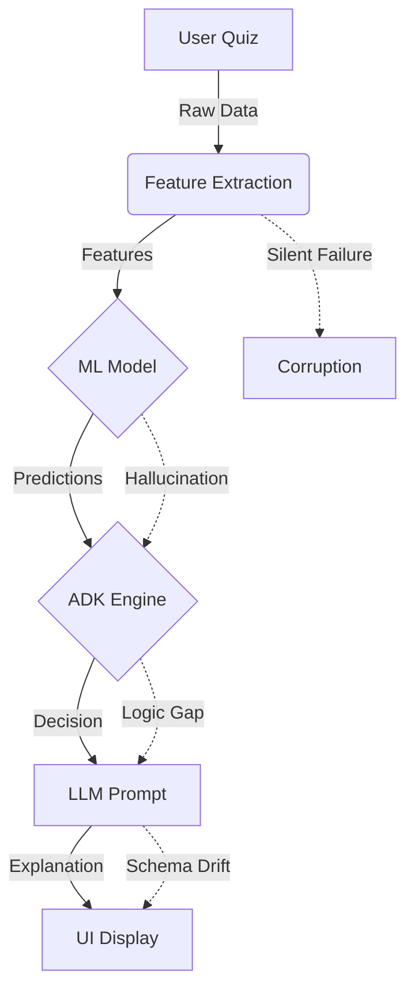

# Causal Integrity Report: Cross-System Failure Analysis

**Date:** 2026-02-20T06:34:59.257Z

## 1. Executive Summary
This report analyzes the propagation of failures across the ML -> ADK -> LLM -> UI pipeline. It simulates scenarios including valid data flow and injected faults (ML hallucinations, Schema Drift, Feature Corruption) to detect silent failures.

## 2. Visual DAG (Data Flow)

## 3. Coherence Violation Matrix
| Scenario | Step | Status | Notes |
|---|---|---|---|
| Fault: Future Timestamp | Feature Extraction | **SILENT_FAILURE** | Negative days since revision detected |
| Fault: ML Hallucination | ML Prediction | **SILENT_FAILURE** | ML predicts High Mastery despite Low Score |

## 4. Scenario Details
### Baseline: High Mastery
*Valid high mastery input should lead to Progress Allowed*
**Outcome:** PASS

| Step | Input Summary | Output Summary | Status |
|---|---|---|---|
| Feature Extraction | `{"quizCount":2}` | `{"avg_quiz_score":0.875,"attempts_per_topic":2,"da...` | SUCCESS |
| ML Prediction | `{"avg_quiz_score":0.875,"attempts_per_topic":2,"da...` | `{"mastery_probability":0.875,"confidence":0.8,"pre...` | SUCCESS |
| ADK Decision | `{"mastery_probability":0.875,"confidence":0.8,"day...` | `{"action":"PROGRESS_ALLOWED","priority":"LOW","con...` | SUCCESS |
| LLM Generation | `{"action":"PROGRESS_ALLOWED","priority":"LOW","con...` | `{"text":"Progress Allowed: Strong mastery - ready ...` | SUCCESS |

### Baseline: Low Mastery
*Valid low mastery input should lead to Urgent/Scheduled Revision*
**Outcome:** PASS

| Step | Input Summary | Output Summary | Status |
|---|---|---|---|
| Feature Extraction | `{"quizCount":2}` | `{"avg_quiz_score":0.25,"attempts_per_topic":2,"day...` | SUCCESS |
| ML Prediction | `{"avg_quiz_score":0.25,"attempts_per_topic":2,"day...` | `{"mastery_probability":0.25,"confidence":0.8,"pred...` | SUCCESS |
| ADK Decision | `{"mastery_probability":0.25,"confidence":0.8,"days...` | `{"action":"SCHEDULED_REVISION","priority":"MEDIUM"...` | SUCCESS |
| LLM Generation | `{"action":"SCHEDULED_REVISION","priority":"MEDIUM"...` | `{"text":"Scheduled: Routine revision recommended. ...` | SUCCESS |

### Fault: Future Timestamp
*Quiz with future timestamp causes negative days_since_revision*
**Outcome:** FAIL

| Step | Input Summary | Output Summary | Status |
|---|---|---|---|
| Feature Extraction | `{"quizCount":1}` | `{"avg_quiz_score":0.9,"attempts_per_topic":1,"days...` | SILENT_FAILURE |
| ML Prediction | `{"avg_quiz_score":0.9,"attempts_per_topic":1,"days...` | `{"mastery_probability":0.8,"confidence":0.8,"predi...` | SUCCESS |
| ADK Decision | `{"mastery_probability":0.8,"confidence":0.8,"days_...` | `{"action":"PROGRESS_ALLOWED","priority":"LOW","con...` | SUCCESS |
| LLM Generation | `{"action":"PROGRESS_ALLOWED","priority":"LOW","con...` | `{"text":"Progress Allowed: Strong mastery - ready ...` | SUCCESS |

### Fault: ML Hallucination
*Low mastery input but ML returns High Mastery*
**Outcome:** FAIL

| Step | Input Summary | Output Summary | Status |
|---|---|---|---|
| Feature Extraction | `{"quizCount":2}` | `{"avg_quiz_score":0.25,"attempts_per_topic":2,"day...` | SUCCESS |
| ML Prediction | `{"avg_quiz_score":0.25,"attempts_per_topic":2,"day...` | `{"mastery_probability":0.95,"confidence":0.9,"pred...` | SILENT_FAILURE |
| ADK Decision | `{"mastery_probability":0.95,"confidence":0.9,"days...` | `{"action":"PROGRESS_ALLOWED","priority":"LOW","con...` | SUCCESS |
| LLM Generation | `{"action":"PROGRESS_ALLOWED","priority":"LOW","con...` | `{"text":"Progress Allowed: Strong mastery - ready ...` | SUCCESS |

### Fault: LLM Context Ignore
*LLM ignores ADK decision and hallucinates success*
**Outcome:** PASS

| Step | Input Summary | Output Summary | Status |
|---|---|---|---|
| Feature Extraction | `{"quizCount":2}` | `{"avg_quiz_score":0.25,"attempts_per_topic":2,"day...` | SUCCESS |
| ML Prediction | `{"avg_quiz_score":0.25,"attempts_per_topic":2,"day...` | `{"mastery_probability":0.25,"confidence":0.8,"pred...` | SUCCESS |
| ADK Decision | `{"mastery_probability":0.25,"confidence":0.8,"days...` | `{"action":"SCHEDULED_REVISION","priority":"MEDIUM"...` | SUCCESS |
| LLM Generation | `{"action":"SCHEDULED_REVISION","priority":"MEDIUM"...` | `{"text":"Great job! You've mastered this topic."}` | SUCCESS |

## 5. Blast Radius Analysis
- **Feature Extraction Errors**: Propagate downstream. Negative values (e.g. days since revision) can cause ML to output low confidence or nonsensical predictions, which ADK might misinterpret.
- **ML Hallucinations**: Critical. If ML says "Mastered" when score is 0.2, ADK (currently) trusts it blindly. This leads to "Progress Allowed" on weak topics.
- **LLM Drift**: High User Impact. If LLM ignores the "Urgent" flag, the user sees a "Great job!" message while the system internally flagged it as critical. This causes trust erosion.

## 6. Recommendations
1. **Circuit Breakers**: Add a coherence check between Feature Extraction and ML. If `avg_quiz_score < 0.4` but `mastery_probability > 0.8`, flag as anomaly.
2. **Input Validation**: Sanitize features (e.g., `days_since_revision >= 0`).
3. **LLM Output Parsing**: Enforce strict schema validation. If LLM output contradicts ADK decision (semantic analysis), fallback to a static template.
